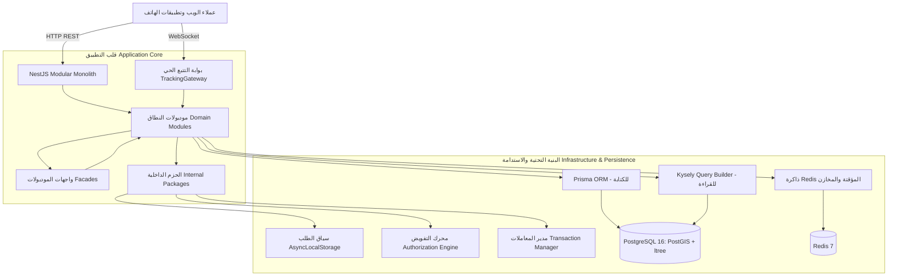
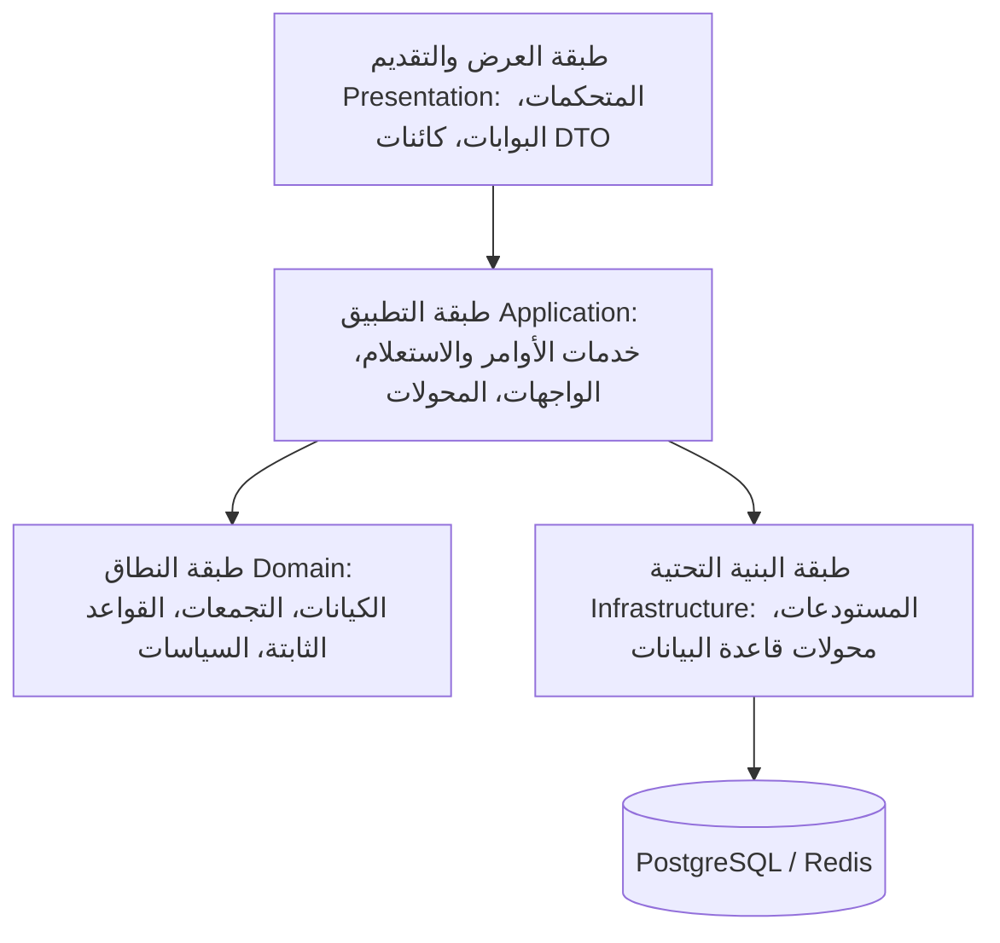
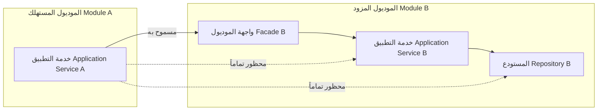
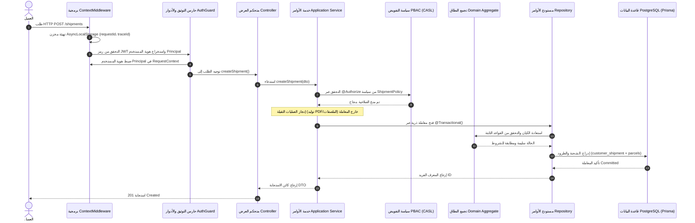

# نظرة عامة على معمارية النظام (Architecture Overview)

## 1. طوبولوجيا النظام: المونويلث المعياري (Modular Monolith)

تم تصميم المنصة بنمط **المونويلث المعياري (Modular Monolith)** باستخدام NestJS. ينظم النظام الوظائف التشغيلية والبرمجية ضمن نطاقات مقيدة (Bounded Domains) بدلاً من الصوامع التقنية المنعزلة (Technical Silos) أو معمارية الخدمات المصغرة (Microservices). يحقق هذا النمط توازناً متقناً بين وضوح حدود النطاقات وسهولة النشر في عملية تشغيلية واحدة (Single-Process Deployment) وبساطة التطوير المحلي.

---

## 2. الطبقات المعمارية داخل الموديول (Module Layering)

يلتزم كل موديول نطاق معقد بفصل صارم للمسؤوليات عبر أربع طبقات:

### طبقة العرض والتقديم (Presentation Layer)
- **المتحكمات وبوابات الاتصال (Controllers & Gateways)**: توفير نهايات طرفية لبروتوكول HTTP REST ومساحات أسماء WebSocket.
- **كائنات نقل البيانات (DTOs)**: التحقق من صحة حمولات البيانات الواردة باستخدام `class-validator`، وتعريف وثائق OpenAPI (Swagger).
- **حراس الأدوار العامة (Role Guards)**: فرض التحقق العام من هوية ونوع المتصل (مثل `@Roles(RoleType.EMPLOYEE)`).

### طبقة التطبيق (Application Layer)
- **خدمات الأوامر (Command Services)**: إدارة وتنسيق حالات الاستخدام (Use Cases)، تنسيق عمليات التحقق، استدعاء منطق النطاق، وإطلاق عمليات الحفظ.
- **خدمات الاستعلام (Query Services)**: تنفيذ تدفقات القراءة فقط، وبناء معايير وتصفية الاستعلامات.
- **الواجهات الموحدة (Facades)**: تصدير قدرات وإمكانيات الموديول العامة ليتم استهلاكها من الموديولات الأخرى بأمان.
- **المحولات (Mappers)**: تحويل كيانات النطاق وسجلات قاعدة البيانات الخام إلى كائنات استجابة DTO.
- **إنفاذ التفويض الدقيق**: حماية دوال الخدمات بواسطة المزخرف `@Authorize()`.

### طبقة النطاق (Domain Layer)
- **جذور التجمعات والكيانات (Aggregate Roots & Entities)**: تغليف قواعد العمل اللوجستية، وحفظ ثوابت الحالة (State Invariants)، وإدارة انتقالات دورة الحياة (مثل `CustomerShipment`، `ShipmentRequest`، `Quotation`).
- **سياسات النطاق (Domain Policies)**: تطبيق عقود `AuthorizationPolicy` للتحقق من صلاحيات الموارد المحددة.
- **أحداث النطاق (Domain Events)**: تعريف الأحداث الداخلية التي تُبث عبر `EventEmitter2`.

### طبقة البنية التحتية (Infrastructure Layer)
- **مستودعات الأوامر (Command Repositories)**: استخدام Prisma (`TransactionalPrismaService`) للإدراج، التحديث الذري، والتحكم المتفائل بالتزامن (OCC).
- **مستودعات الاستعلام (Query Repositories)**: استخدام Kysely (`KYSELY_INSTANCE`) لتنفيذ استعلامات SQL المباشرة والاستقراءات التحليلية.
- **محولات الاستدامة (Persistence Mappers)**: تحويل سجلات قاعدة البيانات الخام إلى لقطات كيانات نطاقية معتبرة.

---

## 3. معمارية الحزم الداخلية (Internal Packages)

تم عزل الاهتمامات المشتركة (Cross-Cutting Concerns) داخل حزم برمجية مستقلة تقع في المسار `src/packages/`:

| الحزمة | المسؤولية التقنية | المكونات الأساسية |
|---|---|---|
| `packages/context` | إدارة سياق الطلب عبر دورة الحياة | `ContextMiddleware`، `AsyncContextProvider`، `RequestContextService`، `Principal` |
| `packages/authorization` | محرك التحكم بالوصول المبني على السياسات (PBAC) | `@Authorize()`، `Policy()`، `AllOf`، `AnyOf`، `Not`، `AuthorizationFacade` |
| `packages/authorization-casl` | جسر تقييم قدرات وصلاحيات CASL | `CaslAbilityBuilder`، محولات كائنات الفحص لـ CASL |
| `packages/transaction` | إدارة حدود المعاملات وعزل البنية التحتية | `@Transactional()`، `TransactionContainer`، `TransactionalPrismaService` |
| `packages/label-generator` | توليد ملصقات الشحن والباركود | `HtmlLabelBuilder`، `QRCodeGenerator`، `BarcodeGenerator` |
| `packages/pdf-generator` | تصيير مستندات PDF عبر متصفح خفي | `PdfGeneratorService` (باستخدام Playwright Chromium) |
| `packages/storage` | تجريد مزود التخزين والملفات | `IStorageProvider`، `LocalStorageProvider`، `TempFilesCleanupService` |
| `packages/firebase-notifications` | إرسال الإشعارات اللحظية عبر السحابة | `FirebaseNotificationService`، `TopicBuilder` |
| `packages/observability` | التتبع الموزع والمقاييس التشغيلية | خطاف ما قبل التشغيل لـ OpenTelemetry NodeSDK (`instrumentation.ts`) |

---

## 4. قواعد التواصل بين الموديولات (Inter-Module Communication)

للحفاظ على السلامة المعمارية ومنع تآكل الحدود البرمجية، تُفرض قواعد تبعية صارمة:

1. **الوصول الحصري عبر الواجهات (Facade-Only Access)**: يُحظر على أي موديول استيراد المستودعات، الخدمات الداخلية، أو الكيانات التابعة لموديول آخر مباشرة. جميع الاستدعاءات يجب أن تمر عبر الواجهة المعلنة للموديول المزود (مثل `TenantFacade`، `FleetFacade`، `CustomerShipmentFacade`).
2. **فك الارتباط عبر الأحداث غير المتزامنة**: في التدفقات التي لا تتطلب رداً لحظياً فورياً (مثل إشعار المشتركين بتغير حالة الطرد)، تقوم الموديولات بنشر أحداث عبر `EventEmitter2` بدلاً من الاستدعاء المباشر المتزامن.
3. **منع التبعيات الدائرية (Circular Dependencies)**: عندما يحتاج موديولان إلى بيانات متبادلة، يتم تطبيق عكس التبعيات (Dependency Inversion) أو عزل المسؤولية في موديول وسيط مخصص. على سبيل المثال، تم عزل `TrackingGatewayModule` عن `TrackingModule` للقضاء على التبعية الدائرية مع `CustomerShipmentModule`.

---

## 5. دورة حياة الطلب (Request Lifecycle)

يوضح المخطط التالي التدفق المعياري لأي طلب كتابة معتمد وموثق يصل إلى المنصة:

