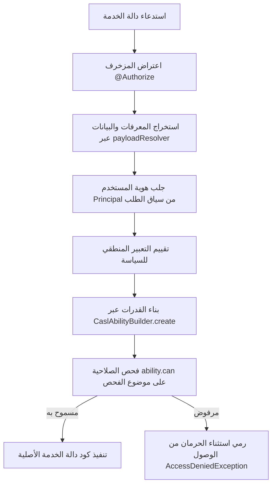

# معمارية التفويض وإدارة الصلاحيات (PBAC & CASL)

يوثق هذا المستند تصميم آليات التحقق من الهوية (Authentication) والتفويض وإدارة الصلاحيات (Authorization)، ويوضح كيفية تكامل السياسات، التعبيرات المنطقية، مجالات الرؤية، وقدرات مكتبة CASL.

---

## 1. التوثيق مقابل التفويض (Authentication vs. Authorization)

يفصل النظام بوضوح بين التحقق من هوية المتصل وتقييم أحقيته في الوصول:

| الجانب | المسؤولية | الآلية التقنية |
|---|---|---|
| **المصادقة (Authentication)** | التحقق من *هوية* المتصل وتحديد ملفه الشخصي النشط. | رموز JWT، تدوير رموز التحديث بقاعدة البيانات (`user_session`)، تجزئة كلمات المرور عبر bcrypt، ورموز OTP. |
| **التفويض العام (Coarse-Grained)** | التحقق من *نوع* وصنف المتصل على مستوى مسارات HTTP. | مزخرف NestJS `@Roles(...)` وحراس الأدوار (مثل `RoleType.EMPLOYEE`، `RoleType.CUSTOMER`). |
| **التفويض الدقيق (PBAC)** | التحقق مما إذا كان المتصل مخولاً لتنفيذ إجراء معين على مورد محدد بسمات معينة. | المزخرف `@Authorize()` المطبق في **طبقة خدمات التطبيق**، وتقييم السياسات عبر `CaslAbilityBuilder`. |
| **تحديد نطاق رؤية البيانات** | تقييد استعلامات القراءة بالسجلات التي يحق للمتصل الاطلاع عليها فقط. | بناة مجالات الرؤية (`VisibilityScopeBuilder`) التي تضيف شروط SQL مباشرة. |

---

## 2. نموذج التحكم بالوصول المبني على السياسات (PBAC)

تم عزل قرارات التفويض الدقيقة تماماً عن طبقة بروتوكول HTTP ومتحكمات العرض، ويتم إعلانها مباشرة على دوال **خدمات التطبيق (Application Services)** باستخدام المزخرف `@Authorize`:



### 2.1 المزخرف `@Authorize`
معرّف داخل `src/packages/authorization/decorators/authorize.decorator.ts`. يستقبل خيارات `AuthorizeOptions`:
```typescript
@Authorize({
  policy: Policy(ShipmentPolicy, ShipmentAction.Create),
  payloadResolver: (dto: CreateShipmentDto) => ({
    originOrgUnitId: dto.originOrgUnitId,
  }),
})
async createShipment(dto: CreateShipmentDto): Promise<{ id: string }> { ... }
```

### 2.2 بناة التعبيرات المنطقية (Expression Builders)
يمكن تركيب وتجميع قواعد التفويض بشكل تعبيري ومرن دون الحاجة لإنشاء سياسات أحادية ضخمة:
- **`Policy(PolicyClass, Action)`**: تقييم صنف سياسة معين تجاه إجراء محدد.
- **`AllOf.sequential(...expressions)`**: تقييم التعبيرات بالتسلسل، والتوقف عند أول تعبير يرفض الصلاحية.
- **`AllOf.parallel(...expressions)`**: تقييم التعبيرات بشكل متزامن عبر `Promise.all`.
- **`AnyOf(...expressions)`**: منح الإذن في حال نجاح تعبير واحد على الأقل.
- **`Not(expression)`**: عكس نتيجة تقييم التعبير المنطقي.

---

## 3. التكامل مع CASL (`packages/authorization-casl`)

تطبق سياسات النطاق العقد الموحد `AuthorizationPolicy<TAction, TPayload>`. وتعتمد داخلياً على مكتبة **CASL** لتعريف وتقييم القواعد استناداً إلى أدوار المستخدم وصلاحياته وتبعيته للمستأجر:

```typescript
@Injectable()
export class ShipmentPolicy implements AuthorizationPolicy<ShipmentAction> {
  constructor(
    private readonly caslFactory: CaslAbilityBuilder,
    private readonly queryRepo: ShipmentQueryRepository,
  ) {}

  async authorize(
    action: ShipmentAction,
    context: AuthorizationContext,
    payload?: ShipmentActionPayload,
  ): Promise<void> {
    const ability = this.caslFactory.create(context.principal);

    switch (action) {
      case ShipmentAction.Create: {
        const principal = context.principal as Principal;
        const candidate = subject(ShipmentSubject, {
          tenantId: principal.tenantId,
          originOrgUnitId: payload?.originOrgUnitId,
        } as any);

        if (!ability.can(action, candidate)) {
          throw new AccessDeniedException(
            `You are not allowed to perform ${action} on this resource.`,
          );
        }
        break;
      }
      // معالجة باقي الإجراءات...
    }
  }
}
```

---

## 4. مجالات الرؤية وتصفية الاستعلامات (Visibility Scopes)

لمنع تحميل سجلات غير مصرح بها إلى الذاكرة ثم فحص صلاحياتها، توفر حزمة التفويض بناة مجالات الرؤية `VisibilityScopeBuilder`:


- عند طلب قوائم الموارد (مثل الشحنات، الموظفين، الفواتير)، تستدعي خدمة الاستعلام باني الرؤية المعني.
- يفحص باني الرؤية دور المستخدم:
  - إذا كان المستخدم **مالك مستأجر (Tenant Owner)**: يغطي النطاق كافة الوحدات التابعة لذلك المستأجر.
  - إذا كان المستخدم **موظفاً (Employee)**: قد يقيد النطاق النتائج بالفروع المعين بها الموظف (`organization_unit_id`).
  - إذا كان المستخدم **عميلاً (Customer)**: يقيد النطاق النتائج بالطلبات والشحنات التي أنشأها ملف العميل فقط.

---

## 5. تقييم قدرات المورد لواجهات المستخدم (Capabilities)

بالنسبة لواجهات المستخدم التي تحتاج لإظهار أو إخفاء أزرار العمليات ديناميكياً (مثل *تعديل*، *إلغاء*، *ترحيل*)، توفر بناة القدرات (مثل `TenantCapabilityBuilder`) فحصاً يدمج بين حالة الكيان وصلاحيات المستخدم:
```typescript
export interface TenantCapabilities {
  canEdit: boolean;
  canSuspend: boolean;
  canActivate: boolean;
  canManageSubscription: boolean;
}
```
يضمن هذا بقاء منطق واجهات المستخدم متطابقاً بنسبة 100% مع سياسات الأمان في الخادم الخلفي.
