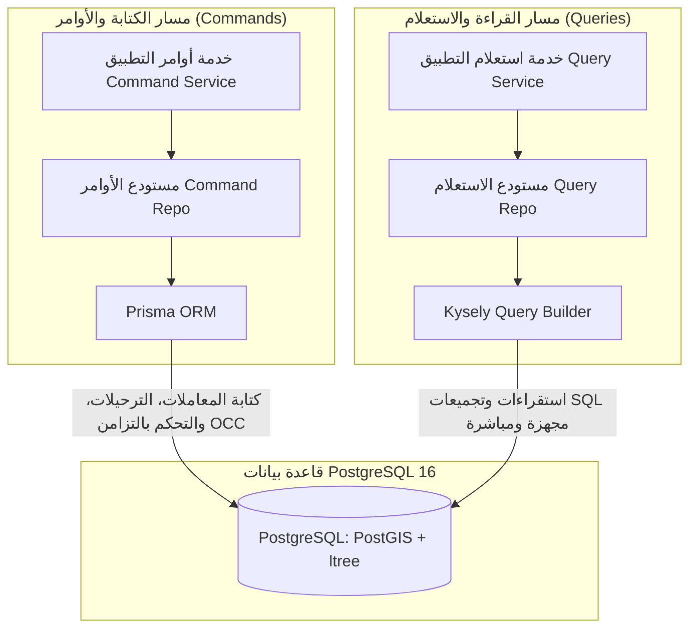

# نمط CQRS والوصول إلى قاعدة البيانات (Prisma + Kysely)

يوثق هذا المستند معمارية فصل مسؤولية الأوامر عن الاستعلامات (CQRS) المطبقة في طبقة استدامة البيانات عبر المنصة.

---

## 1. الاستراتيجية المعمارية: فصل مسار القراءة عن الكتابة

تفصل المنصة عمليات قاعدة البيانات إلى مسارين متميزين يشتركان في نفس خادم PostgreSQL الخلفي:



| المسار | التقنية | المبرر المعماري الأساسي |
|---|---|---|
| **الأوامر (الكتابة)** | **Prisma ORM** | إدارة ترحيل المخططات (Migrations)، القيود العلائقية، المفاتيح الأجنبية، وسلامة طفرات المعاملات. |
| **الاستعلامات (القراءة)** | **Kysely Query Builder** | تنفيذ استعلامات SQL ذات كفاءة عالية ومحددة الأنماط بدقة، مع تفادي استهلاك الذاكرة في إحياء كائنات الكيانات (No Entity Hydration) عند استعراض التقارير والقوائم الضخمة. |

---

## 2. مسار الكتابة: محرك Prisma ORM

تحقن مستودعات الأوامر (مثل `ShipmentCommandRepository` و `TenantCommandRepository`) خدمة `TransactionalPrismaService`.

### المسؤوليات الأساسية:
- **إدارة ترحيلات المخطط (Schema Migrations)**: يدير Prisma أوامر DDL، الفهارس، وامتدادات PostgreSQL (`ltree`, `postgis`) عبر ملف `prisma/schema.prisma`.
- **التحكم المتفائل بالتزامن (OCC)**: تُنفذ تحديثات الحالة بشروط ذرية تمنع الكتابة فوق التعديلات المتزامنة (`where: { id, version }, data: { version: { increment: 1 } }`).
- **العمليات الذرية**: يتكامل تلقائياً مع المزخرف `@Transactional()` عبر سياق المعاملة المشترك.

---

## 3. مسار القراءة: بانِي الاستعلامات Kysely

تحقن مستودعات الاستعلام (مثل `ShipmentQueryRepository`، `TenantQueryRepository`، و `StatisticsRepository`) الرمز البرمجي `'KYSELY_INSTANCE'`.

### 3.1 توليد الأنماط آلياً عبر `prisma-kysely`
يتم توليد أنماط TypeScript لـ Kysely تلقائياً من مخطط Prisma عند تنفيذ الأمر `npm run db:generate`:
```prisma
generator kysely {
  provider        = "prisma-kysely"
  output          = "../src/infrastructure/database/generated/kysely"
  fileName        = "types.ts"
}
```
يضمن ذلك تمتع استعلامات Kysely بأمان صارم للأنواع (Type Safety) أثناء وقت الترجمة بناءً على آخر ترحيلات المخطط دون الحاجة لكتابة واجهات يدوية مكررة.

### 3.2 مزايا الاستقراء المباشر للقراءة
1. **اختيار الأعمدة بدقة (Explicit Selection)**: جلب الأعمدة المطلوبة فقط لكائن الاستجابة DTO، مما يمنع جلب بيانات غير ضرورية (Over-Fetching).
2. **إلغاء تكلفة معالجة الكيانات (No Hydration Overhead)**: تُرجع الاستعلامات كائنات JavaScript قياسية مباشرة من برمجية التشغيل (`pg.Pool`) دون تحويلها لكيانات معقدة ومراقبتها في الذاكرة.
3. **الاستعلامات المعقدة والتجميعات**: سهولة صياغة الاستعلامات الفرعية، مطابقة المسارات الشجرية لامتداد `ltree`، ودوال PostGIS المكانية التي يتعذر التعبير عنها بكفاءة في أدوات ORM التقليدية.

### مثال على استعلام Kysely داخل المستودع:
```typescript
async findSummaryById(id: string): Promise<ShipmentSummaryDto | null> {
  return this.db
    .selectFrom('customer_shipment')
    .select([
      'id',
      'status',
      'service_level as serviceLevel',
      'total_chargeable_weight_kg as totalWeight',
      'created_at as createdAt',
    ])
    .where('id', '=', id)
    .executeTakeFirst() ?? null;
}
```

---

## 4. مسبح اتصالات قاعدة البيانات (Connection Pooling)

يتصل كل من Prisma و Kysely بنفس قاعدة بيانات PostgreSQL:
- يدير Prisma مسبح اتصالاته الداخلي وفقاً لمعاملات متغير البيئة `DATABASE_URL`.
- يستخدم Kysely محول `PostgresDialect` بالاعتماد على مسبح `pg.Pool` مستقل:
  ```typescript
  new Kysely<DB>({
    dialect: new PostgresDialect({
      pool: new Pool({
        connectionString: configService.get<string>('DATABASE_URL'),
        max: Number(configService.get('DATABASE_POOL_MAX') ?? 40),
      }),
    }),
  });
  ```
يجب على المهندسين عند إعداد بيئات الإنتاج موازنة حجم المسبحين معاً للتأكد من أن مجموع اتصالات Prisma و `pg.Pool` لا يتجاوز الحد الأقصى المسموح به في خادم PostgreSQL (`max_connections`).
