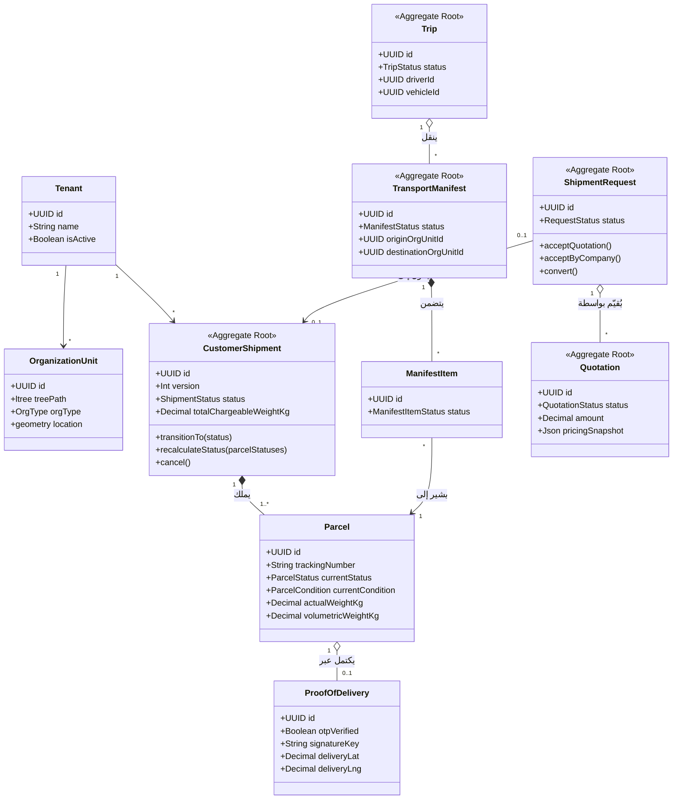

# نموذج النطاق وحدود التجمعات (Domain Model & Aggregate Boundaries)

يصف هذا المستند نموذج النطاق اللوجستي، علاقات الكيانات، حدود التجمعات (Aggregates)، والقواعد الثابتة (Invariants) المستندة بشكل مباشر إلى مخطط قاعدة البيانات وتطبيق كيانات النطاق في المستودع.

---

## 1. نظرة عامة على التجمعات (Aggregates Overview)

يقسم النظام عملياته اللوجستية إلى تجمعات مستقلة للحفاظ على حدود الاتساق (Consistency Boundaries) دون الحاجة لأقفال معاملات واسعة تعطل الأداء:



---

## 2. الكيانات والتجمعات الأساسية

### 2.1 شحنة العميل والطرود (CustomerShipment & Parcel)
- **المصدر المرجعي**: `src/modules/customer-shipment/shipment/domain/entities/customer-shipment.entity.ts` وجداولي Prisma `customer_shipment` و `parcel`.
- **حدود التجمع**: الكيان `CustomerShipment` هو جذر التجمع (Aggregate Root)، ويملك طرداً واحداً أو أكثر (`Parcel`). تعديل مجموعة الطرود، إلغاء الشحنة، أو احتساب الوزن الإجمالي يمر حتماً عبر جذر الشحنة.
- **القواعد الثابتة الأساسية**:
  - **التحكم المتفائل بالتزامن (OCC)**: محمي بعمود رقمي `version`. تُنفذ طفرات التعديل في قاعدة البيانات بشرط `where: { id, version }` مع زيادة `version` بمقدار 1. وإذا لم يطابق أي صف، يُرمى استثناء تعارض `ConflictException`.
  - **المصدر والوجهة**: يجب ألا تتطابق الوحدة التنظيمية المصدر `originOrgUnitId` مع الوحدة الوجهة `destinationOrgUnitId`.
  - **معادلة احتساب الوزن القابل للفوترة (Chargeable Weight)**:
    $$\text{Total Chargeable Weight} = \sum_{p \in \text{Parcels}} \max\left(p.\text{actualWeightKg},\, p.\text{volumetricWeightKg}\right)$$
  - **قاعدة التدرج التصاعدي (Monotonic Lifecycle)**: لا يمكن لمسح طرد وصل متأخراً أو غير مرتب أن يعيد حالة الشحنة الكلية إلى الوراء في دورة حياتها (`ALLOWED_TRANSITIONS[this._status].includes(target)`).

### 2.2 إثبات التسليم (Proof of Delivery - POD)
- **المصدر المرجعي**: جدول Prisma `model proof_of_delivery`.
- **العلاقة**: علاقة واحد لواحد (1-to-1) مع جدول الطرود `parcel` (`@@unique([parcel_id])`).
- **القواعد الثابتة**:
  - يتطلب تحديد الموظف المسؤول عن التسليم (`delivered_by_employee_id`).
  - يخزن بيانات التحقق: اسم المستلم، الرقم الوطني الاختياري، حالة التحقق برمز OTP (`otp_verified`)، مفتاح التوقيع الرقمي المخزن (`signature_key`)، صور الطرد، والإحداثيات الجغرافية للتسليم (`delivery_lat`، `delivery_lng`).

### 2.3 طلب الشحن وعرض السعر (ShipmentRequest & Quotation)
- **المصدر المرجعي**: `src/modules/shipment-request/request/domain/entities/shipment-request.entity.ts` و `src/modules/shipment-request/quotation/domain/entities/quotation.entity.ts`.
- **حدود التجمع**: يمثل `ShipmentRequest` طلب العميل الأولي غير المؤكد، بينما يمثل `Quotation` التقييم المالي للتكلفة. تم فصلهما في تجمعين مستقلين للسماح بإجراء مفاوضات تسعيرية متعددة دون التلاعب ببيانات طلب العميل.
- **القواعد الثابتة**:
  - لا يمكن قبول عرض السعر إلا إذا كان الطلب في حالة `PENDING`.
  - لا يُسمح بتحويل الطلب إلى شحنة تشغيلية نشطة `CustomerShipment` إلا بعد وصوله إلى حالة `COMPANY_ACCEPTED`.
  - موازنة بنود السعر في العرض: `amount === basePrice + weightCharge + extraFees`.

### 2.4 الوحدات التنظيمية وطوبولوجيا الشبكة (OrganizationUnit)
- **المصدر المرجعي**: جدول Prisma `model organization_unit`.
- **التصنيفات اللوجستية**: `REGION` (إقليم)، `HUB` (مركز رئيسي)، `WAREHOUSE` (مستودع)، `BRANCH` (فرع)، `LOCKER` (خزانة ذكية).
- **النمذجة الهرمية**: تعتمد على امتداد PostgreSQL `ltree` عبر العمود `tree_path` (مثل `Root.RegionA.Hub01.Branch12`).
- **الإحداثيات الجغرافية**: تعتمد على امتداد PostGIS عبر عمود `location` (`Unsupported("geometry")`) المفهرس عبر مؤشر GiST (`idx_org_unit_location`).

### 2.5 إدارة الأسطول: المركبات، التعيينات، والرحلات (Fleet)
- **المصدر المرجعي**: جداول Prisma `model vehicle`، `model vehicle_assignment`، و `model trip`.
- **القواعد الثابتة**:
  - **منع الازدواجية في التعيين**: يتم ضمان عدم تعيين سائق أو مركبة في أكثر من مسار نشط واحد في نفس الوقت على مستوى قاعدة البيانات عبر فهارس فريدة جزئية (Partial Unique Indexes):
    ```prisma
    @@unique([employee_id], map: "unique_active_employee_assignment", where: { is_active: true })
    @@unique([vehicle_id], map: "unique_active_vehicle_assignment", where: { is_active: true })
    ```

### 2.6 منافست النقل وبنود المنافست (TransportManifest & ManifestItem)
- **المصدر المرجعي**: جداول Prisma `model transport_manifest` و `model manifest_item`.
- **الحدود**: تجميع الطرود المخصصة لرحلة نقل بين مرفقين (`origin_org_unit_id` $\rightarrow$ `destination_org_unit_id`).
- **الحالات التشغيلية للمنافست**: `OPEN` $\rightarrow$ `READY_FOR_DISPATCH` $\rightarrow$ `ASSIGNED` $\rightarrow$ `LOADING` $\rightarrow$ `IN_TRANSIT` $\rightarrow$ `COMPLETED`.
- **حالات بنود المنافست**: تتبع حالة تحميل كل طرد داخل المنافست: `PENDING_LOAD`، `LOADED`، `UNLOADED`، `MISSING`.

### 2.7 حركة الطرود وسلسلة الحيازة (ParcelMovement)
- **المصدر المرجعي**: جدول Prisma `model parcel_movement`.
- **الحدود**: مخزن أحداث تراكمي للإضافة فقط (Append-Only Event Store) يسجل كل حركة استلام، تسليم، ومسح باركود:
  - هوية الموظف المنفذ (`performed_by_employee_id`)، اسم الوحدة التنظيمية (`organization_unit_id`)، والرحلة المرتبطة `trip_id`.
  - تسجيل الفروقات في الحالة: `previous_status`، `new_status`، والحالة الفيزيائية للطرود `previous_condition`، `new_condition`.
  - حفظ الإحداثيات الجغرافية الدقيقة لحظة وقوع الحدث.

### 2.8 الفوترة والمدفوعات (Billing)
- **المصدر المرجعي**: جداول Prisma `model invoice`، `model invoice_counter`، و `model payment`.
- **ثبات التسلسل الرقمي**: يعتمد `invoice_counter` على مفتاح رئيسي مركب `[tenant_id, year]` لضمان توليد تسلسلات رقمية ذرية وغير متقطعة لفواتير كل مستأجر داخل السنة المالية.
- **تسوية المدفوعات**: تسجيل طريقة الدفع (`CASH`، `ONLINE`، `COD`، `BANK_TRANSFER`) وتحديث رصيد الفاتورة (`UNPAID` $\rightarrow$ `PARTIALLY_PAID` $\rightarrow$ `PAID`).
