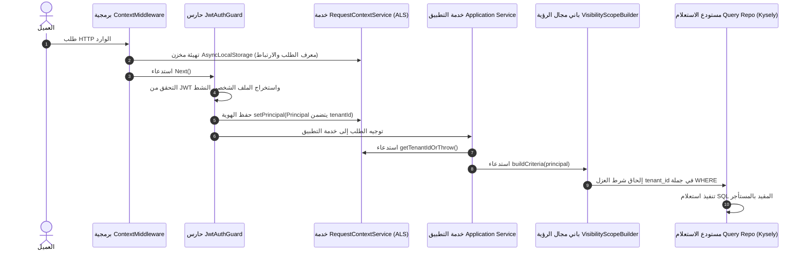

# معمارية تعدد المستأجرين وسياق الطلب (Multi-Tenancy Architecture)

يصف هذا المستند كيفية عزل بيانات المستأجرين وإدارة سياق العمليات عبر أرجاء المنصة.

---

## 1. نموذج تعدد المستأجرين: عملية مشتركة وعمود تمييز

تعتمد المنصة معمارية **قاعدة بيانات ومخطط مشترك (Shared-Database, Shared-Schema)**. تستقر بيانات جميع المستأجرين داخل نفس قاعدة بيانات PostgreSQL، ويتم الفصل بينها باستخدام عمود مفتاح أجنبي:
- `tenant_id`: عمود من نوع UUID متواجد في الجداول المملوكة للمستأجر (مثل `customer_shipment`، `parcel`، `employee`، `organization_unit`، `vehicle`، `invoice`).
- الكيانات العامة على مستوى المنصة (مثل جدول المستخدمين `users` وجدول المواقع الجغرافية `global_location`) هي كيانات عالمية لا تتبع لمستأجر واحد.

يُفرض عزل المستأجرين برمجياً عبر تمرير سياق الطلب ومحددات مجالات الرؤية (Visibility Scopes) بدلاً من إنشاء مخططات منفصلة أو تبديل اتصالات قاعدة البيانات.

---

## 2. تمرير سياق الطلب عبر `AsyncLocalStorage`

لتجنب تمرير المعرف `tenantId` يدوياً كمعامل عبر كل دالة في المتحكمات والخدمات والمستودعات، يعتمد النظام على ميزة Node.js **`AsyncLocalStorage`** المغلفة في الحزمة `src/packages/context/`.



### المكونات الأساسية:
1. **`ContextMiddleware`**: مسجلة بشكل عام (`forRoutes('*')`) داخل `ContextModule`. تقوم بإنشاء `requestId` فريد وتهيئة مخزن `AsyncLocalStorage` قبل وصول الطلب للمتحكمات.
2. **`Principal`**: كائن يمثل هوية المستخدم الأمنية يتم تخزينه في السياق عبر `RequestContextService.setPrincipal()`. يتضمن `userId`، `tenantId`، الأدوار `roles`، والصلاحيات `permissions`.
3. **`RequestContextService`**: يوفر دوال وصول سهلة وآمنة لاستخراج السياق:
   ```typescript
   public getTenantIdOrThrow(): string {
     const tenantId = this.getTenantId();
     if (!tenantId) {
       throw new Error('Tenant ID is missing from the current request context.');
     }
     return tenantId;
   }
   ```

---

## 3. إنفاذ حدود الوصول إلى البيانات (Data-Access Boundaries)

تحمي المعمارية البيانات من التسرب بين المستأجرين على مستويين:

### 3.1 عمليات الكتابة (مستودعات الأوامر في Prisma)
أثناء عمليات الكتابة، تستخرج الخدمات معرف المستأجر النشط مباشرة من `RequestContextService` وتربط السجلات الجديدة صراحة بـ `tenant_id`:
```typescript
const tenantId = this.requestContext.getTenantIdOrThrow();
await this.commandRepository.create({ tenantId, ...dto });
```

### 3.2 عمليات القراءة (محددات مجالات الرؤية Visibility Scopes)
في جانب الاستعلام والقراءة، توفر حزمة التفويض بناة مجالات الرؤية (مثل `TenantVisibilityScope`، `ShipmentRequestVisibilityScope`).
تفحص هذه الأدوات هوية المستخدم `Principal` وتلحق شروط العزل الإلزامية باستعلامات قاعدة البيانات:
```typescript
// إلحاق شرط عزل المستأجر قبل تنفيذ الاستعلام
where('tenant_id', '=', principal.tenantId)
```

---

## 4. هوية المستخدم متعددة المستأجرين والتبديل بين الحسابات (Profile Switching)

يمكن للمستخدم الواحد في جدول `users` التعامل مع عدة مستأجرين:
- قد يكون المستخدم مالكاً للمستأجر **Tenant A**، وسائقاً أو موظفاً في المستأجر **Tenant B**، وحساب شحن شخصي كـ **Customer**.
- أثناء تسجيل الدخول، تتحقق خدمة المصادقة من الملفات الشخصية النشطة للمستخدم.
- عند إصدار الرمز (أو التبديل عبر `select-profile`)، يُشفر الرمز المعرف الخاص بالملف النشط `tenantId`.
- يتلقى سياق الطلب فقط الـ `tenantId` المقترن بالملف الشخصي المختار حالياً.

---

## 5. حالات الفشل المحتملة والتنبيهات المعمارية (Caveats)

تم تصميم النظام لمنع تسرب البيانات، ولكن يجب على المهندسين مراعاة الحالات التالية:

1. **المهام المجدولة في الخلفية (Background Tasks & Cron Jobs)**:
   تعمل المهام المجدولة (مثل `LocationFlusherService` أو `InvoiceDueReminderJob`) خارج سياق طلبات HTTP. وبالتالي، فهي **لا تملك** سياق `AsyncLocalStorage` نشط. يجب على هذه المهام التكرار صراحة عبر المستأجرين أو قراءة `tenant_id` مباشرة من السجلات بدلاً من استدعاء `RequestContextService.getTenantIdOrThrow()`.

2. **معالجات الأحداث غير المتزامنة (Asynchronous Event Handlers)**:
   عند إطلاق أحداث عبر `EventEmitter2` ومعالجتها بشكل غير متزامن، قد لا ينتقل سياق الـ ALS تلقائياً. يجب تمرير `tenantId` صراحة ضمن حمولة الحدث (Event Payload).

3. **استعلامات Kysely المباشرة غير المقيدة**:
   نظراً لأن Kysely يبني استعلامات SQL حرة، يجب على المطورين دوماً استخدام بناة الرؤية (Visibility Scopes) أو إضافة شرط `where('tenant_id', '=', tenantId)`. إغفال هذا الشرط في استعلام مخصص قد يؤدي إلى قراءة بيانات تتجاوز حدود المستأجر.
