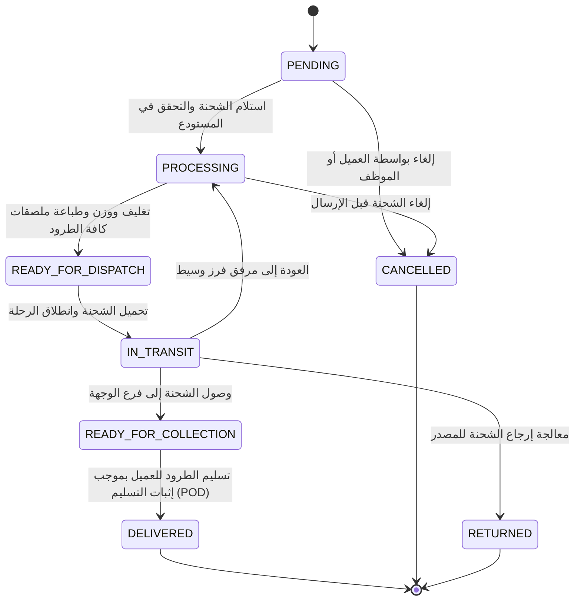
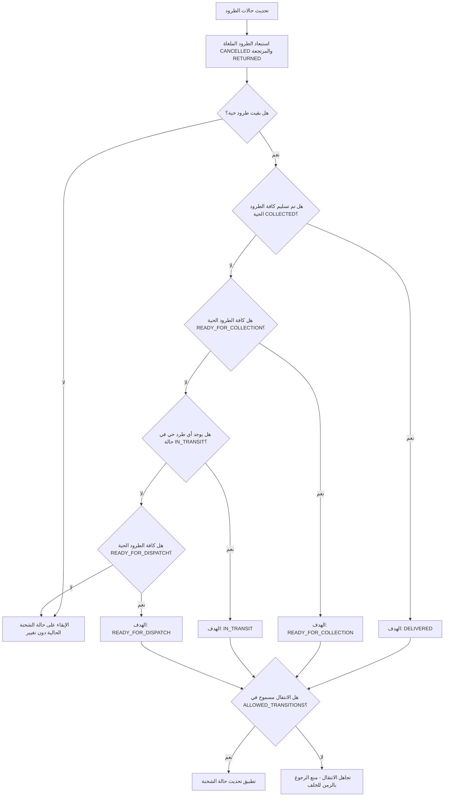

# دورة حياة الشحنة وانتقالات الحالة (Shipment Lifecycle & State Transitions)

يوثق هذا المستند آلة حالة الشحنة (State Machine)، آليات مزامنة حالات الطرود، حواجز التزامن وحماية التعديل، وقواعد الإلغاء بالاستناد المباشر إلى تطبيق كيان النطاق `CustomerShipment` (`src/modules/customer-shipment/shipment/domain/entities/customer-shipment.entity.ts`).

---

## 1. آلة حالة الشحنة (Shipment State Machine)

يفرض كيان الشحنة انتقالات حالة صريحة ومحددة سلفاً. أي محاولة للانتقال إلى حالة غير معرفة في مصفوفة الانتقالات المسموحة `ALLOWED_TRANSITIONS` تؤدي مباشرة إلى رمي استثناء تعارض `ConflictException`.



### جدول قواعد الانتقال (Transition Rules Table)

| الحالة الحالية | الحالات التالية المسموح بها | المشغلات والشروط الثابتة (Invariants) |
|---|---|---|
| `PENDING` | `PROCESSING`, `CANCELLED` | تم إنشاء سجل الشحنة؛ بانتظار استلامها وفرزها في المستودع. |
| `PROCESSING` | `READY_FOR_DISPATCH`, `CANCELLED` | تم قياس أبعاد الطرود ووزنها وطباعة ملصقات الباركود وتأكيد التغليف. |
| `READY_FOR_DISPATCH` | `IN_TRANSIT` | تم تضمين الطرود في منافست نقل وغادرت الرحلة المرفق. |
| `IN_TRANSIT` | `PROCESSING`, `READY_FOR_COLLECTION`, `RETURNED` | الوصول إلى مركز فرز وسيط (`PROCESSING`)، أو الوصول لفرع التسليم النهائي (`READY_FOR_COLLECTION`)، أو فشل التسليم والعودة للمصدر (`RETURNED`). |
| `READY_FOR_COLLECTION` | `DELIVERED` | استلام العميل للطرد في الفرع أو عبر السائق. يتطلب إثبات تسليم معتمد (POD). |
| `DELIVERED` | *(لا يوجد - حالة نهائية)* | اكتملت عملية الشحن بنجاح؛ لا يُسمح بأي انتقال بعدها. |
| `CANCELLED` | *(لا يوجد - حالة نهائية)* | مسموح فقط من حالتي `PENDING` أو `PROCESSING`. يُحظر الإلغاء بعد الشحن. |
| `RETURNED` | *(لا يوجد - حالة نهائية)* | تمت إعادة الشحنة بالكامل إلى المرفق المصدر؛ حالة نهائية مغلقة. |

---

## 2. مزامنة حالات الطرود التلقائية (Parcel Status Recalculation)

تحتوي الشحنة الواحدة `CustomerShipment` على طرد واحد أو أكثر (`Parcel`). بدلاً من تحديث حالة الشحنة الكلية يدوياً وبشكل منفصل، يوفر كيان النطاق خوارزمية ذكية لاشتقاق حالة الشحنة: `recalculateStatus(parcelStatuses: ParcelStatus[])`.

### الحالات المعتمدة للطرود (Parcel Statuses)
- `PROCESSING`
- `READY_FOR_DISPATCH`
- `IN_TRANSIT`
- `ARRIVED_AT_UNIT`
- `READY_FOR_COLLECTION`
- `COLLECTED`
- `RETURNED`
- `CANCELLED`

### منطق اشتقاق الحالة (`recalculateStatus`)



#### ثبات التدرج التصاعدي (Monotonic Progression Invariant)
في البيئات اللوجستية الواقعية، قد تتأخر عمليات مسح الباركود بسبب ضعف شبكة الاتصال وتصل إلى الخادم بترتيب غير متسلسل (Out-of-Order Execution). لمنع حدوث انتكاسة في حالة الشحنة، تفحص دالة `recalculateStatus`:
```typescript
if (!ALLOWED_TRANSITIONS[this._status].includes(target)) {
  return null;
}
```
يضمن هذا الشرط أن وصول مسح قديم متأخر لن يعيد الشحنة أبداً إلى مرحلة سابقة من دورة حياتها.

---

## 3. حماية التزامن والتعارض (Optimistic Concurrency Control)

تشهد مراكز التوزيع حركة مسح باركود متزامنة وسريعة على بوابات تفريغ متعددة في نفس اللحظة. لمنع مشكلة الكتابة المتضاربة وفقدان التحديثات (Lost Updates)، يطبق كيان `CustomerShipment` نمط التحكم المتفائل بالتزامن (OCC):

1. **إصدار الكيان (Entity Versioning)**: يحمل الكيان حقلاً رقمياً `version` (يبدأ بالقيمة 1).
2. **التحديث الشرطي الذري (Atomic Conditional Update)**: عند حفظ تغيير الحالة في `ShipmentCommandRepository`:
   ```typescript
   const result = await this.prisma.client.customer_shipment.updateMany({
     where: { id: shipmentId, version: currentVersion },
     data: { status: newStatus, version: { increment: 1 } },
   });

   if (result.count === 0) {
     throw new ConflictException(
       'Shipment was modified by another process. Please retry.',
     );
   }
   ```
3. عند محاولة عمليتين تعديل الشحنة في نفس الوقت، تنجح العملية الأولى وترفع قيمة `version`. أما العملية الثانية فتجد أن القيمة تغيرت (0 صفوف مطابقة)، وتفشل فوراً بـ `ConflictException`، مما يوجه النظام لإعادة قراءة أحدث حالة والمحاولة بأمان.

---

## 4. قواعد إلغاء الشحنات (Cancellation Rules)

- يُسمح بإلغاء الشحنة فقط أثناء تواجدها في حالتي `PENDING` أو `PROCESSING` (حيث تُرجع دالة `isCancellable()` القيمة `true`).
- بمجرد دخول الشحنة في حالة `READY_FOR_DISPATCH` أو `IN_TRANSIT`، يُحظر الإلغاء عبر مسار العمليات الاعتيادي للعميل.
- الشحنة التي تُلغى جميع طرودها تظل في حالتها حتى يقوم مستخدم مخول بإلغاء الشحنة ككل صراحة.
