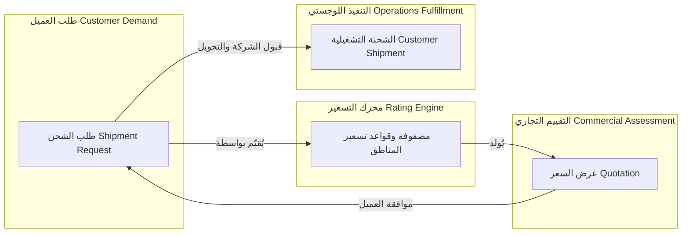
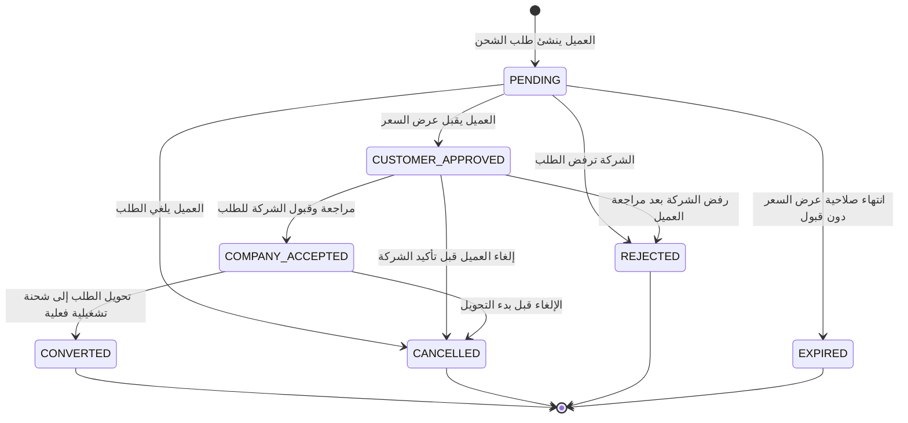
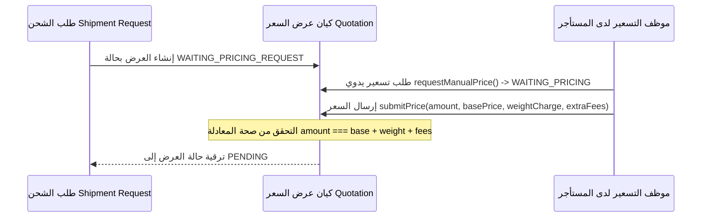

# محرك طلبات الشحن والتسعير وعروض الأسعار (Shipment Request, Pricing & Quotation)

يوضح هذا المستند آليات استقبال الطلبات، محرك التسعير الديناميكي، إصدار عروض الأسعار، وتدفق تحويل الطلب إلى شحنة تشغيلية كما هو مطبق داخل `src/modules/shipment-request/`.

---

## 1. الفصل المعماري بين المسؤوليات (Separation of Responsibilities)

يفصل النظام بوضوح بين أربعة مفاهيم أساسية لمنع اختلاط الاهتمامات التشغيلية بالتجارية:



| المفهوم | المسؤولية التقنية والوظيفية | جدول التخزين |
|---|---|---|
| **طلب الشحن (Shipment Request)** | استيعاب رغبة الشحن غير المؤكدة للعميل (المرسل، المستلم، الطرود، العناوين). | `shipment_request` |
| **مصفوفة تسعير المناطق (Zone Pricing Matrix)** | قواعد التسعير المعرفة لكل مستأجر بحسب المناطق الجغرافية ومستويات الخدمة. | `zone_pricing_matrix`, `handling_fee_rule` |
| **عرض السعر (Quotation)** | تقييم مالي محدد الصلاحية الزمنية لطلب شحن معين، مع تجميد بنود التكلفة. | `quotation` |
| **الشحنة التشغيلية (Customer Shipment)** | التجمع التشغيلي الذي يتم إنشاؤه فور قبول الطلب للشروع في نقله وتنفيذه. | `customer_shipment` |

---

## 2. دورة حياة طلب الشحن (Shipment Request Lifecycle)

يفرض تجمع `ShipmentRequest` (`src/modules/shipment-request/request/domain/entities/shipment-request.entity.ts`) آلة حالة مسبقة للعمليات:



### القواعد الثابتة (Invariants):
1. **قبول عرض السعر (`acceptQuotation`)**: يتطلب أن يكون الطلب في حالة `PENDING`. ينقل الحالة إلى `CUSTOMER_APPROVED` ويثبت معرف العرض المقبول `approvedQuotationId`.
2. **قبول الشركة (`acceptByCompany`)**: يتطلب حالة `CUSTOMER_APPROVED`. ينقل الطلب إلى حالة `COMPANY_ACCEPTED`.
3. **التحويل للشحن (`convert`)**: مسموح به حصراً عندما يكون الطلب في حالة `COMPANY_ACCEPTED`. ينقل الحالة إلى `CONVERTED` ويطلق إنشاء الشحنة اللوجستية التشغيلية.
4. **حدود الإلغاء والرفض**: الطلبات التي وصلت إلى حالات `CONVERTED` أو `CANCELLED` أو `REJECTED` أو `EXPIRED` لا يمكن إلغاؤها أو رفضها مجدداً.

---

## 3. محرك التسعير الديناميكي وحساب التكلفة

يستنتج محرك التسعير التكلفة الإجمالية بالاعتماد على علاقات مناطق المستأجر، الأوزان الحجمية، ورسوم المناولة الإضافية:

### 3.1 حساب الوزن القابل للفوترة (Chargeable Weight)
يتم تسعير الشحن بناءً على الوزن القابل للفوترة، وهو القيمة الأكبر بين الوزن الفعلي والوزن الحجمي:

$$\text{Volumetric Weight (kg)} = \frac{\text{Length (cm)} \times \text{Width (cm)} \times \text{Height (cm)}}{\text{Volumetric Divisor}}$$

$$\text{Chargeable Weight} = \max\left(\text{Actual Weight},\, \text{Volumetric Weight}\right)$$

> ملاحظة: يُضبط المعامل الحجمي `Volumetric Divisor` لكل مستأجر في جدول `tenant_pricing_settings` (القيمة الافتراضية: `5000`).

### 3.2 مطابقة مصفوفة تسعير المناطق (Zone Matrix)
يحدد المستأجر مسارات الشحن في جدول `zone_pricing_matrix` المفهرس بواسطة:
`[tenant_id, origin_zone_id, destination_zone_id, service_level]`

- **السعر الأساسي (Base Price)**: يغطي الشحنة حتى الحد الأقصى للوزن الأساسي `base_weight_kg`.
- **رسوم الوزن الإضافي (Excess Weight Charge)**:
  $$\text{Weight Charge} = \max\left(0,\, \text{Chargeable Weight} - \text{base\_weight\_kg}\right) \times \text{price\_per\_extra\_kg}$$

### 3.3 رسوم المناولة الخاصة (Specialized Handling)
تُضاف رسوم إضافية من جدول `handling_fee_rule` للطرود التي تحمل وسم تصنيف خاص:
- `FRAGILE` (قابل للكسر)
- `PERISHABLE` (سريع التلف)
- `HAZARDOUS` (مواد خطرة)
- `TEMPERATURE_SENSITIVE` (حساس لدرجات الحرارة)

### 3.4 مستويات الخدمة (Service Levels)
تتفاوت أسعار المسارات بناءً على اتفاقية مستوى الخدمة المطلوبة:
- `STANDARD`: التوصيل البري الاعتيادي.
- `EXPRESS`: الشحن السريع ذو الأولوية.
- `SAME_DAY`: التوصيل في نفس اليوم عبر السائقين المحليين.
- `REFRIGERATED`: النقل المبرد المخصص.

---

## 4. تجمع عروض الأسعار وتجميد الأسعار (Quotation Aggregate)

يدير تجمع `Quotation` (`src/modules/shipment-request/quotation/domain/entities/quotation.entity.ts`) عروض الأسعار المالية:

### 4.1 أنواع عروض الأسعار
- **آلي (`AUTOMATIC`)**: يُولد فورياً عبر مراقبي أحداث النطاق (`QuotationListener`) بمجرد توفر تطابق مباشر للمسار في `zone_pricing_matrix`.
- **يدوي (`MANUAL`)**: يأخذ حالة `WAITING_PRICING_REQUEST` أو `WAITING_PRICING` عندما تتطلب طبيعة البضائع أو المسار تدخلاً بشرياً لتحديد السعر.

### 4.2 تدفق التسعير اليدوي (Manual Workflow)


### 4.3 لقطة التسعير المجمدة غير القابلة للتغيير (Immutable Snapshot)
عند إصدار عرض السعر، يتم حفظ لقطة غير قابلة للتعديل لكافة بنود وقواعد التسعير في عمود JSON يُدعى `pricing_snapshot`:
```json
{
  "basePrice": 25.00,
  "weightCharge": 12.50,
  "handlingFees": 5.00,
  "currency": "SY",
  "calculatedAt": "2026-09-16T12:00:00Z"
}
```
يضمن هذا التجميد أنه حتى في حال قيام المستأجر بتعديل مصفوفة أسعاره أو تعرفة رسوم المناولة لاحقاً، فإن عروض الأسعار النشطة والمقبولة ستحتفظ بأسعارها المتفق عليها بدقة دون أي تأثر.

### 4.4 صلاحية العرض (Expiration)
يحمل كل عرض سعر توقيتاً نهائياً `valid_until` يُحسب بالاعتماد على إعدادات المستأجر `quotation_validity_hours` (الافتراضي: 48 ساعة). لا يمكن للعميل قبول أي عرض تجاوز مهلة الصلاحية.
