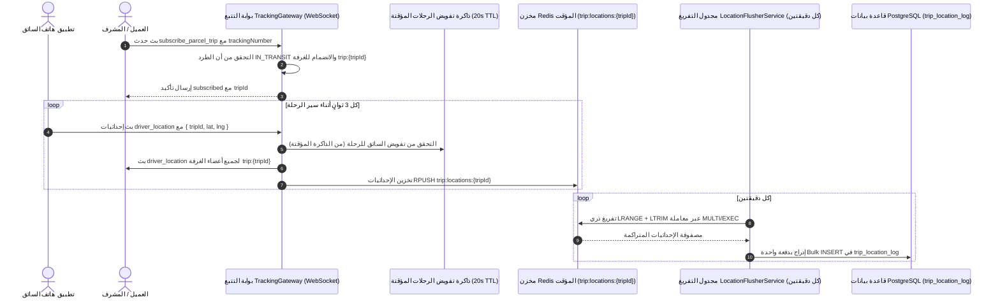

# معمارية التليماتكس والتتبع اللحظي وسلسلة الحيازة (Tracking & Telematics)

يوثق هذا المستند آليات التتبع، استيعاب تليماتكس السائقين، البث اللحظي عبر WebSockets، ونمط التخزين المرحل (Write-Behind) المطبق في `src/modules/tracking/` و `src/modules/tracking-gateway.module.ts`.

---

## 1. معرفات التتبع وسلسلة الحيازة (Custody Chain)

### 1.1 توليد أرقام التتبع الفريدة (Tracking Number Generation)
يحمل كل طرد رقم تتبع فريد عالمياً `tracking_number` يتم توليده قبل الإدراج في قاعدة البيانات:
```typescript
const candidate = `${trackingPrefix}${randomSuffix}`;
```
في حال حدوث تصادم نادر في الرقم المتولد، يعيد النظام المحاولة تلقائياً حتى حد أقصى محدد قبل إرجاع استثناء ودي للمستخدم، متفادياً إيقاف العملية بانهيار مفاجئ لقيد الفهرس الفريد في قاعدة البيانات.

### 1.2 سجل الحيازة غير القابل للتعديل (`parcel_movement`)
تُسجل كل عملية تسليم واستلام ومسح باركود في جدول `parcel_movement` التراكمي (Append-Only):
- **هوية المنفذ**: معرف الموظف `performed_by_employee_id` واسمه.
- **المرفق والسياق**: معرف الوحدة التنظيمية `organization_unit_id`، اسمها، ومعرف الرحلة الاختياري `trip_id`.
- **فروقات الحالة**: الحالة السابقة `previous_status`، الحالة الجديدة `new_status`، والحالة الفيزيائية للطرود `previous_condition`، `new_condition`.
- **الموقع الجغرافي**: الإحداثيات الدقيقة `organization_latitude`، `organization_longitude`.
- **أنواع الإجراءات المعتمدة**: `RECEIVED_AT_BRANCH`، `LOADED_ON_TRIP`، `TRIP_DEPARTED`، `ARRIVED_AT_FACILITY`، `READY_FOR_COLLECTION`، `COLLECTED`، `RETURN_COMPLETED`، `CANCELLED`، `CONDITION_UPDATED`، `POD_COMPLETED`.

---

## 2. استيعاب التليماتكس وبوابة WebSockets اللحظية

تتم إدارة إحداثيات GPS للسائقين وأحداث الطرود الحية عبر `TrackingGateway` (`src/modules/tracking/presentation/gateways/tracking.gateway.ts`):



### 2.1 مواصفات أحداث الـ WebSocket

| اسم الحدث | الاتجاه | حمولة البيانات (Payload) | الوصف |
|---|---|---|---|
| `subscribe_parcel_trip` | العميل $\rightarrow$ الخادم | `{ trackingNumber: string }` | انضمام العميل لغرفة الـ WebSocket الخاصة بالرحلة النشطة التي تحمل الطرد. |
| `subscribed` | الخادم $\rightarrow$ العميل | `{ tripId: string, tripNumber?: string }` | تأكيد نجاح الاشتراك في غرفة الرحلة. |
| `driver_location` | العميل $\rightarrow$ الخادم | `{ tripId: string, lat: number, lng: number }` | إرسال جهاز السائق لإحداثيات الـ GPS المباشرة. |
| `driver_location` | الخادم $\rightarrow$ العميل | `{ tripId: string, lat: number, lng: number, recordedAt: string }` | بث إحداثيات السائق اللحظية لكافة المتصلين المشتركين في غرفة الرحلة. |
| `parcel_movement` | الخادم $\rightarrow$ العميل | `{ parcelId, trackingNumber, actionType, status, ... }` | إشعار لحظي عند تسجيل حركة طرد جديدة على مسار الرحلة. |

### 2.2 التخزين المؤقت لتفويض السائقين (Short-Lived Auth Cache)
يبث السائقون إحداثياتهم بمعدل مرة كل 3 ثوانٍ تقريباً. لمنع استعلام قاعدة البيانات مع كل نبضة واردة، تحتفظ بوابة `TrackingGateway` بذاكرة تفويض داخلية في الذاكرة بمدة صلاحية 20 ثانية (`tripAuthCache`). بعد التحقق الأولي، تتم معالجة النبضات المتتالية خلال هذه النافذة الزمنية فورياً في الذاكرة.

---

## 3. نمط التخزين المرحل في Redis (`LocationFlusherService`)

كتابة إحداثيات GPS عالية التردد في جداول PostgreSQL مباشرة مع كل نبضة يؤدي إلى استنزاف هائل لوحدات الإدخال والإخراج (Disk I/O) وتحديث فهارس PostGIS المكانية باستمرار واستهلاك اتصالات قاعدة البيانات. للتغلب على ذلك، يعتمد النظام نمط **التخزين المرحل (Write-Behind Ingestion)**:

1. **مخزن التجميع الأولي (Redis Buffer)**:
   يتم تحويل الإحداثيات الواردة إلى JSON ودفعها فورياً في قائمة Redis خفيفة:
   ```text
   المفتاح: trip:locations:{tripId}
   البيانات: [ "{ lat, lng, recordedAt, driverId }", ... ]
   ```

2. **التفريغ الذري الدوري (`@Cron('*/2 * * * *')`)**:
   تعمل خدمة `LocationFlusherService` كل دقيقتين. ولتجنب مشاكل تعارض القراءة والكتابة أثناء استمرار السائقين في الإرسال، يتم سحب وتفريغ القائمة ذرياً عبر معاملة Redis واحدة (`MULTI` / `EXEC`):
   ```typescript
   const results = await this.redis
     .multi()
     .lrange(key, 0, -1)
     .ltrim(key, 1, 0)
     .exec();
   ```
   - `lrange(key, 0, -1)` يجلب كافة الإحداثيات المتجمعة في القائمة.
   - `ltrim(key, 1, 0)` يمسح القائمة ذرياً وفي نفس اللحظة.

3. **الإدراج الجماعي في قاعدة البيانات (Bulk Insert)**:
   يتم تفكيك الإحداثيات وحفظها بدفعة واحدة عبر أمر `createMany` في جدول `trip_location_log` داخل PostgreSQL، مما يحافظ على السجل التاريخي لمسارات الرحلات بأقل فترة اتصال ممكنة بقاعدة البيانات.

---

## 4. فك الارتباط ومنع التبعيات الدائرية (Circular Dependencies)

يحتاج موديول الشحنات `CustomerShipmentModule` إلى بيانات التتبع، بينما تحتاج بوابة التتبع `TrackingGateway` إلى التحقق من حالة الشحنات.

لمنع حدوث حلقة استيراد دائرية (`CustomerShipmentModule` $\leftrightarrow$ `TrackingModule`)، تم عزل البوابة وخدمة التفريغ في موديول مستقل هو **`TrackingGatewayModule`** (`src/modules/tracking-gateway.module.ts`):
- يستورد `TrackingGatewayModule` كلاً من `CustomerShipmentModule` و `FleetModule`.
- تتواصل خدمة أوامر التتبع `TrackingCommandService` مع البوابة حصراً باستخدام الأحداث غير المتزامنة (`EventEmitter2`)، مما يبقي شجرة التبعيات أحادية الاتجاه (Acyclic).
