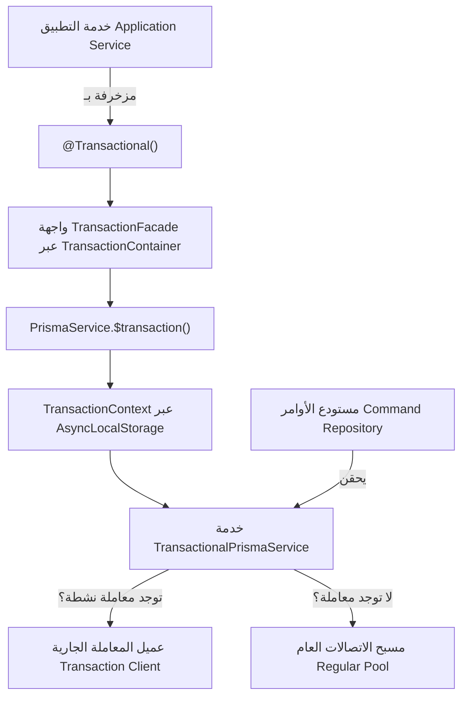
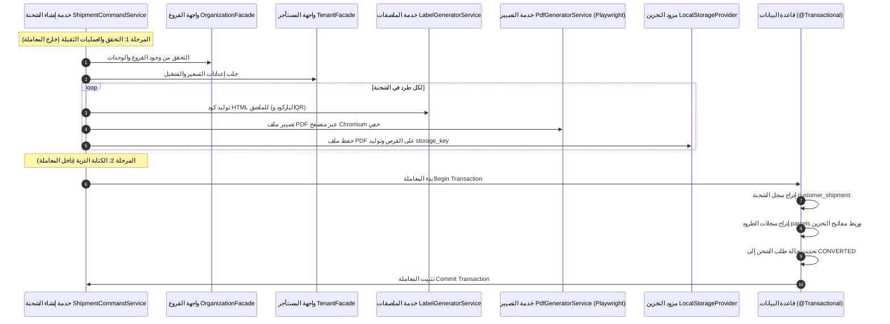

# معمارية إدارة المعاملات وقواعد البيانات (Transaction Management)

يوثق هذا المستند كيفية إدارة معاملات قواعد البيانات (Database Transactions) عبر خدمات ومستودعات التطبيق دون تسريب تبعيات البنية التحتية الخاصة بـ ORM إلى قلب منطق النطاق.

---

## 1. الهدف المعماري: عزل البنية التحتية (Infrastructure Isolation)

في المعمارية النظيفة (Clean Architecture) والتصميم الموجه بالنطاق (DDD)، تقوم خدمات التطبيق بتنسيق تدفقات العمل، ويجب ألا تعتمد مباشرة على كائنات المعاملات الخاصة بـ ORM معين (مثل `PrismaClient.$transaction` أو مؤشرات SQL الخام).

يعالج النظام هذا التحدي عبر الحزمة `src/packages/transaction/`، والتي تعتمد على **نمط الحاوية (Container Pattern)** وميزة **`AsyncLocalStorage`** لفصل حدود المعاملة عن تفاصيل تطبيق المستودعات.



---

## 2. المكونات الأساسية للحزمة (`packages/transaction`)

### 2.1 مزخرف الدوال `@Transactional()`
يحدد دالة خدمة التطبيق كحد لمعاملة ذرية (Atomic Boundary):
- إذا كانت هناك معاملة نشطة بالفعل في سلسلة الاستدعاء، يعيد المزخرف استخدام نفس العميل (إعادة استخدام متداخلة Re-entrant).
- إذا لم تكن هناك معاملة قائمة، يطلب معاملة جديدة عبر `TransactionFacade`.
- يتم اعتماد المعاملة (Commit) تلقائياً عند انتهاء الدالة بنجاح، ويتم التراجع عنها (Rollback) تلقائياً عند حدوث أي استثناء غير معالج.

```typescript
@Injectable()
export class ShipmentCommandService {
  @Transactional()
  private async persistShipment(
    tenantId: string,
    dto: CreateShipmentDto,
    prepared: PreparedParcel[],
    totalChargeableWeightKg: number,
  ): Promise<{ id: string }> {
    // كلا استدعاءي المستودع يتم تنفيذهما داخل نفس المعاملة تماماً
    const shipment = await this.commandRepository.create(...);
    for (const parcel of prepared) {
      await this.parcelCommandRepository.create(...);
    }
    return shipment;
  }
}
```

### 2.2 سياق المعاملة `TransactionContext` (`AsyncLocalStorage`)
يتتبع عميل معاملة Prisma النشط (`tx`) طوال سلسلة التنفيذ غير المتزامن. ونتيجة لذلك، لا تحتاج المستودعات إلى تمرير كائن `tx` كمعامل إضافي في توقيع دوالها.

### 2.3 خدمة الوكيل `TransactionalPrismaService`
كائن وسيط ذكي يُحقن في مستودعات الأوامر:
```typescript
@Injectable()
export class TransactionalPrismaService {
  constructor(private readonly prisma: PrismaService) {}

  get client(): PrismaClient {
    const tx = TransactionContext.getClient();
    return (tx as PrismaClient) ?? this.prisma;
  }
}
```
عند استدعائه داخل نطاق `@Transactional()`، يُرجع `client` عميل المعاملة الجارية. وخلاف ذلك، يعود تلقائياً لمسبح اتصالات `PrismaService` العام.

### 2.4 حاوية المعاملات `TransactionContainer`
تطبيق لنمط محدد الخدمات (Service Locator) يتم تهيئته عند إقلاع التطبيق في `main.ts` (`TransactionContainer.setApp(app)`). يتيح هذا للمزخرف `@Transactional()` الوصول إلى `TransactionFacade` دون إجبار الخدمات على حقن `PrismaService` في مشيداتها.

---

## 3. قاعدة التصميم: المعاملات قصيرة المدى والتجهيز المسبق

تفرض المعمارية قاعدة ذهبية: **إبقاء المعاملات قصيرة قدر الإمكان** لتقليل فترة احتجاز اتصالات قاعدة البيانات وتفادي اختناقات الأقفال (Lock Contention).

### مثال: تدفق إنشاء الشحنة (`ShipmentCommandService.createShipment`)



**أهمية هذا الفصل**:
- تصيير الملفات عبر Playwright وعمليات التخزين على القرص تستغرق زمناً غير متوقع (I/O Latency).
- لو نُفذت هذه العمليات الثقيلة داخل معاملة قاعدة بيانات مفتوحة، لنفدت اتصالات مسبح قاعدة البيانات فورياً عند أول ضغط تشغيلي.
- بتجهيز الملفات مسبقاً، تفتح المعاملة فقط لبضعة أجزاء من الألف من الثانية لإنجاز عمليات الإدراج السريعة.
