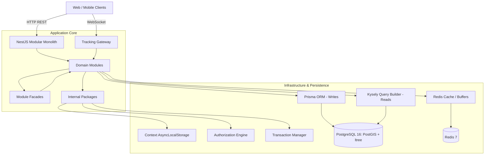
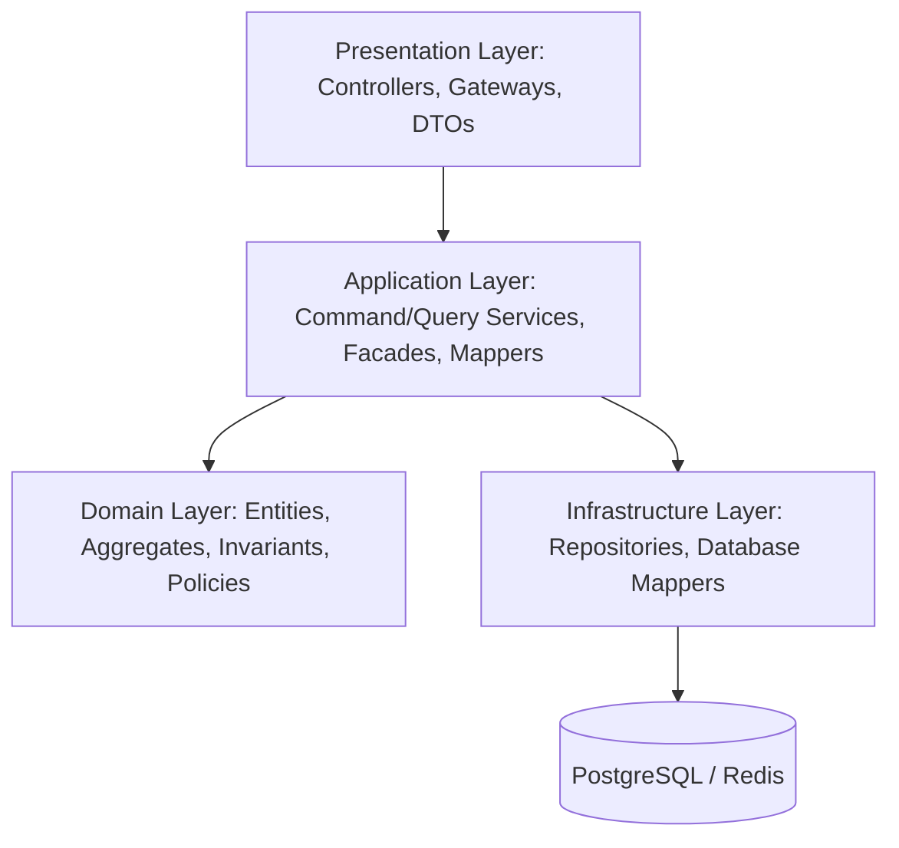
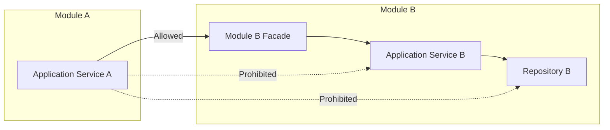
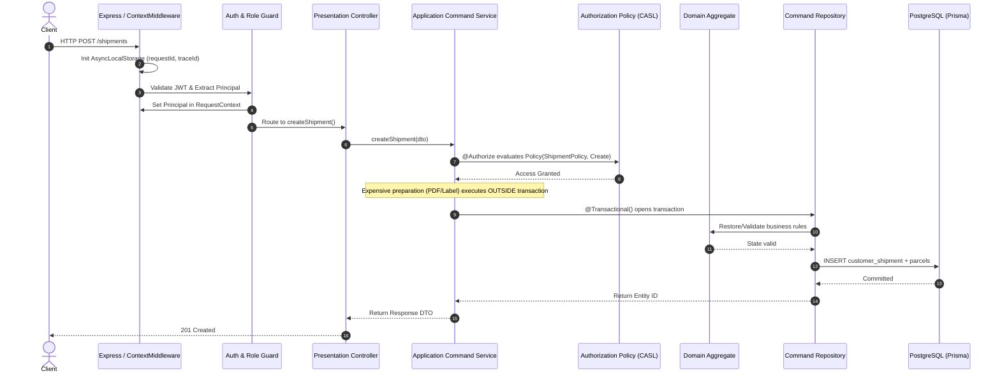

# Architecture Overview

## 1. System Topology: Modular Monolith

The platform is designed as a **Modular Monolith** using NestJS. The system organizes functionality into bounded domains rather than technical silos or microservices, balancing clear domain boundaries with single-process deployment and local development simplicity.

---

## 2. Layering within Modules

Each complex domain module adheres to a clean separation of concerns across four layers:

### Presentation Layer
- **Controllers & Gateways**: Expose HTTP REST endpoints and WebSocket namespaces.
- **DTOs**: Validate incoming payloads using `class-validator` and define OpenAPI documentation.
- **Role Guards**: Enforce coarse-grained authentication and user type validation (e.g. `@Roles(RoleType.EMPLOYEE)`).

### Application Layer
- **Command Services**: Orchestrate business use cases, coordinate validation, call domain logic, and trigger persistence.
- **Query Services**: Execute read-only workflows and construct query criteria.
- **Facades**: Export public module capabilities to other modules.
- **Mappers**: Transform domain entities and raw database rows into response DTOs.
- **Authorization Enforcement**: Fine-grained `@Authorize()` decorators guard service methods.

### Domain Layer
- **Aggregate Roots & Entities**: Encapsulate domain rules, state invariants, and lifecycle transitions (e.g., `CustomerShipment`, `ShipmentRequest`, `Quotation`).
- **Domain Policies**: Implement `AuthorizationPolicy` contracts for resource-specific permissions.
- **Domain Events**: Internal event definitions dispatched via `EventEmitter2`.

### Infrastructure Layer
- **Command Repositories**: Use Prisma (`TransactionalPrismaService`) for atomic inserts, updates, and optimistic locking.
- **Query Repositories**: Use Kysely (`KYSELY_INSTANCE`) to execute SQL queries and analytical projections directly.
- **Persistence Mappers**: Map raw database records to domain entity snapshots.

---

## 3. Internal Packages Architecture

Cross-cutting infrastructure concerns are encapsulated in independent packages located in `src/packages/`:

| Package | Responsibility | Key Components |
|---|---|---|
| `packages/context` | Request-scoped context management | `ContextMiddleware`, `AsyncContextProvider`, `RequestContextService`, `Principal` |
| `packages/authorization` | Policy-based access control engine | `@Authorize()`, `Policy()`, `AllOf`, `AnyOf`, `Not`, `AuthorizationFacade` |
| `packages/authorization-casl` | CASL ability evaluation bridge | `CaslAbilityBuilder`, CASL subject adapters |
| `packages/transaction` | Clean transaction boundary management | `@Transactional()`, `TransactionContainer`, `TransactionalPrismaService` |
| `packages/label-generator` | Shipping label synthesis | `HtmlLabelBuilder`, `QRCodeGenerator`, `BarcodeGenerator` |
| `packages/pdf-generator` | Headless PDF rendering | `PdfGeneratorService` (Playwright Chromium) |
| `packages/storage` | File storage provider abstraction | `IStorageProvider`, `LocalStorageProvider`, `TempFilesCleanupService` |
| `packages/firebase-notifications` | Push notification delivery | `FirebaseNotificationService`, `TopicBuilder` |
| `packages/observability` | Distributed tracing & metrics | OpenTelemetry NodeSDK pre-runtime hook (`instrumentation.ts`) |

---

## 4. Inter-Module Communication Rules

To preserve architectural integrity in a monolithic codebase, strict dependency rules are enforced:

1. **Facade-Only Access**: A module must never import another module's Repositories, Services, or Entities directly. All cross-module requests pass through that module's exported `Facade` (e.g., `TenantFacade`, `FleetFacade`, `CustomerShipmentFacade`).
2. **In-Memory Decoupling**: For asynchronous workflows (e.g., notifying subscribers after parcel status updates), modules publish internal events via `EventEmitter2` rather than calling consuming facades synchronously.
3. **Circular Dependency Avoidance**: Where two modules need data from one another, dependency inversion or dedicated coordination modules are introduced. For example, `TrackingGatewayModule` is isolated from `TrackingModule` to eliminate circular coupling with `CustomerShipmentModule`.

---

## 5. Request Lifecycle

The standard lifecycle for an incoming authenticated write request:

