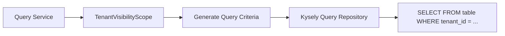

# Authorization Architecture (PBAC & CASL)

This document details the authentication and authorization design across the platform, explaining how policies, expressions, visibility scopes, and CASL abilities interact.

---

## 1. Authentication vs. Authorization

The platform separates identity verification from access evaluation:

| Aspect | Responsibility | Mechanism |
|---|---|---|
| **Authentication** | Verifies *who* the caller is and establishes active profile context. | JWT access tokens, database-backed refresh token rotation (`user_session`), bcrypt password hashing, OTP verification. |
| **Coarse-Grained Authorization** | Verifies caller *type* at the HTTP route level. | NestJS `@Roles(...)` decorators and role guards (e.g. `RoleType.EMPLOYEE`, `RoleType.CUSTOMER`). |
| **Fine-Grained Authorization (PBAC)** | Verifies whether the caller is permitted to perform a specific action on a specific resource with given attributes. | `@Authorize()` decorator at the **Application Service layer**, evaluating policies via `CaslAbilityBuilder`. |
| **Data Visibility Scoping** | Constrains read queries to records the caller is permitted to see. | Visibility Scope Builders (`VisibilityScopeBuilder`) applying SQL predicates. |

---

## 2. Policy-Based Access Control (PBAC) Model

Fine-grained authorization decisions are decoupled from HTTP transport and controller routing. They are declared on **Application Service** methods using `@Authorize`:

```mermaid
flowchart TD
    Req[Incoming Method Call] --> Decorator[@Authorize Interceptor]
    Decorator --> ResolvePayload[payloadResolver Extracts DTO / ID]
    ResolvePayload --> Context[Retrieve Principal from RequestContext]
    Context --> PolicyExec[Evaluate Authorization Expression]
    PolicyExec --> Casl[CaslAbilityBuilder.create with Principal]
    Casl --> Check[ability.can with Subject Candidate]
    Check -- Allowed --> ExecuteMethod[Invoke Original Service Method]
    Check -- Denied --> ThrowError[Throw AccessDeniedException]
```

### 2.1 The `@Authorize` Decorator
Defined in `src/packages/authorization/decorators/authorize.decorator.ts`. It accepts `AuthorizeOptions`:
```typescript
@Authorize({
  policy: Policy(ShipmentPolicy, ShipmentAction.Create),
  payloadResolver: (dto: CreateShipmentDto) => ({
    originOrgUnitId: dto.originOrgUnitId,
  }),
})
async createShipment(dto: CreateShipmentDto): Promise<{ id: string }> { ... }
```

### 2.2 Expression Builders
Authorization rules can be composed declaratively without creating monolithic policy classes:
- **`Policy(PolicyClass, Action)`**: Evaluates an individual policy class against an action.
- **`AllOf.sequential(...expressions)`**: Evaluates expressions in order, stopping on the first failure.
- **`AllOf.parallel(...expressions)`**: Evaluates expressions concurrently via `Promise.all`.
- **`AnyOf(...expressions)`**: Evaluates expressions; passes if at least one expression grants access.
- **`Not(expression)`**: Inverts the decision of an expression.

---

## 3. CASL Integration (`packages/authorization-casl`)

Domain policies implement the `AuthorizationPolicy<TAction, TPayload>` contract. Under the hood, they use **CASL** to define and evaluate rule sets based on the user's roles, permissions, and active tenant assignment:

```typescript
@Injectable()
export class ShipmentPolicy implements AuthorizationPolicy<ShipmentAction> {
  constructor(
    private readonly caslFactory: CaslAbilityBuilder,
    private readonly queryRepo: ShipmentQueryRepository,
  ) {}

  async authorize(
    action: ShipmentAction,
    context: AuthorizationContext,
    payload?: ShipmentActionPayload,
  ): Promise<void> {
    const ability = this.caslFactory.create(context.principal);

    switch (action) {
      case ShipmentAction.Create: {
        const principal = context.principal as Principal;
        const candidate = subject(ShipmentSubject, {
          tenantId: principal.tenantId,
          originOrgUnitId: payload?.originOrgUnitId,
        } as any);

        if (!ability.can(action, candidate)) {
          throw new AccessDeniedException(
            `You are not allowed to perform ${action} on this resource.`,
          );
        }
        break;
      }
      // other actions...
    }
  }
}
```

---

## 4. Visibility Scopes & Query Filtering

To prevent loading unauthorized records into memory before checking permissions, the authorization package provides `VisibilityScopeBuilder`:



- When querying lists of resources (e.g. shipments, employees, invoices), the query service invokes the relevant visibility scope.
- The visibility scope checks the user's role:
  - If the user is a `Tenant Owner`, the scope covers all organizational units belonging to that tenant.
  - If the user is an `Employee`, the scope may restrict results to the employee's assigned branches (`organization_unit_id`).
  - If the user is a `Customer`, the scope restricts results to requests or shipments created by the customer's profile.

---

## 5. Resource Capability Evaluation

For user interfaces requiring conditional action buttons (e.g. *Edit*, *Cancel*, *Dispatch*), domain builders such as `TenantCapabilityBuilder` evaluate entity state alongside user permissions:
```typescript
export interface TenantCapabilities {
  canEdit: boolean;
  canSuspend: boolean;
  canActivate: boolean;
  canManageSubscription: boolean;
}
```
This keeps UI permission logic synchronized with backend policy rules.
