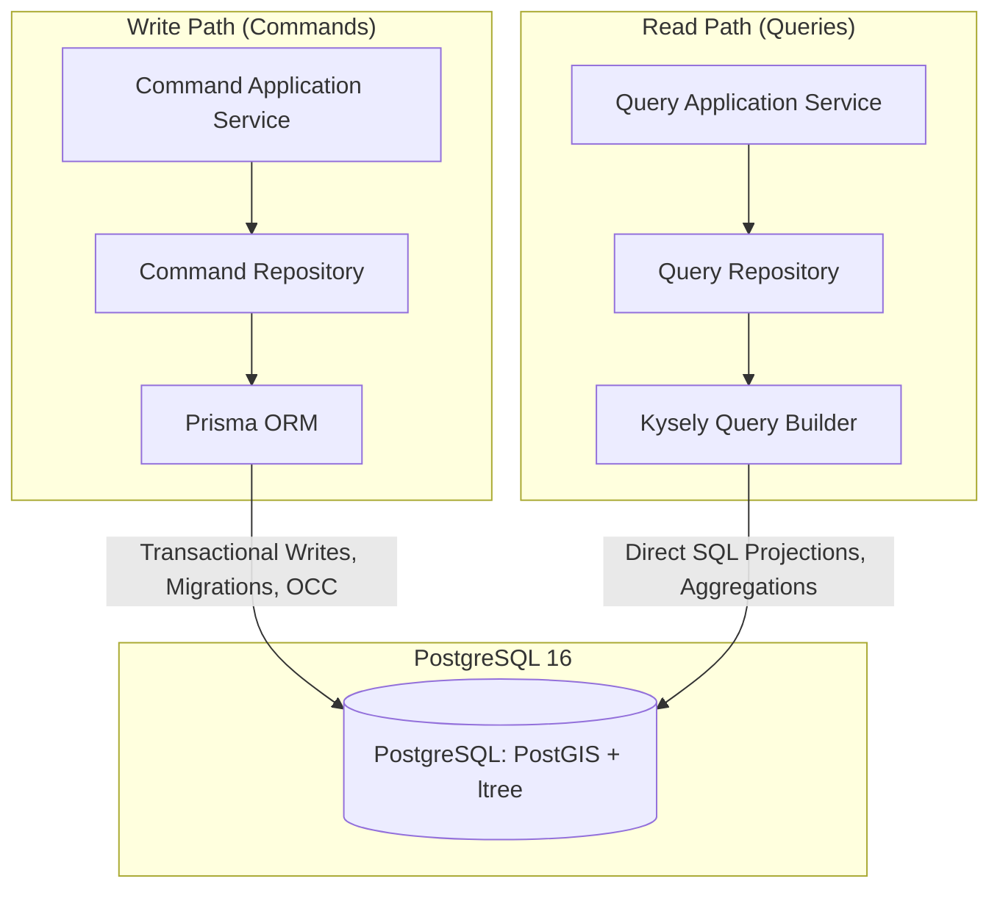

# Database Access & CQRS Pattern (Prisma + Kysely)

This document describes the Command-Query Responsibility Segregation (CQRS) persistence architecture implemented across the platform.

---

## 1. Architectural Strategy: Read/Write Split

The platform splits database operations into two distinct access paths sharing the same underlying PostgreSQL instance:



| Path | Technology | Primary Rationale |
|---|---|---|
| **Commands (Writes)** | **Prisma ORM** | Manages schema migrations, relational constraints, foreign keys, lifecycle integrity, and transactional mutations. |
| **Queries (Reads)** | **Kysely Query Builder** | Executes typed SQL queries directly, avoiding ORM entity hydration on read-heavy projections and analytical aggregations. |

---

## 2. Write Path: Prisma ORM

Command repositories (e.g. `ShipmentCommandRepository`, `TenantCommandRepository`) inject `TransactionalPrismaService`.

### Responsibilities:
- **Schema Migrations**: Prisma manages database DDL, indices, and PostgreSQL extensions (`ltree`, `postgis`) via `prisma/schema.prisma`.
- **Optimistic Concurrency Control (OCC)**: Writes update records using atomic version conditions (`where: { id, version }, data: { version: { increment: 1 } }`).
- **Atomic Operations**: Works seamlessly with `@Transactional()` via the transaction context.

---

## 3. Read Path: Kysely Query Builder

Query repositories (e.g. `ShipmentQueryRepository`, `TenantQueryRepository`, `StatisticsRepository`) inject `'KYSELY_INSTANCE'`.

### 3.1 Type Generation via `prisma-kysely`
TypeScript types for Kysely are generated automatically from the Prisma schema during `npm run db:generate`:
```prisma
generator kysely {
  provider        = "prisma-kysely"
  output          = "../src/infrastructure/database/generated/kysely"
  fileName        = "types.ts"
}
```
This guarantees that Kysely queries benefit from strict compile-time type-safety reflecting current schema migrations without manually maintaining separate TypeScript interfaces.

### 3.2 Benefits for Read Projections
1. **Explicit Column Selection**: Selects only the columns needed by the API response DTO, preventing over-fetching.
2. **Elimination of Hydration Overhead**: Returns plain JavaScript objects directly from the PostgreSQL driver (`pg.Pool`), avoiding ORM object mapping and tracking.
3. **Complex Joins & Aggregations**: Enables clean SQL subqueries, `ltree` path matches, and geospatial PostGIS functions that are cumbersome in standard ORMs.

### Example Kysely Query in Repository:
```typescript
async findSummaryById(id: string): Promise<ShipmentSummaryDto | null> {
  return this.db
    .selectFrom('customer_shipment')
    .select([
      'id',
      'status',
      'service_level as serviceLevel',
      'total_chargeable_weight_kg as totalWeight',
      'created_at as createdAt',
    ])
    .where('id', '=', id)
    .executeTakeFirst() ?? null;
}
```

---

## 4. Connection Pooling

Both Prisma and Kysely connect to the same PostgreSQL database:
- Prisma manages its internal connection pool configured via `DATABASE_URL`.
- Kysely uses `PostgresDialect` with an explicit `pg.Pool`:
  ```typescript
  new Kysely<DB>({
    dialect: new PostgresDialect({
      pool: new Pool({
        connectionString: configService.get<string>('DATABASE_URL'),
        max: Number(configService.get('DATABASE_POOL_MAX') ?? 40),
      }),
    }),
  });
  ```
Engineers configuring production environments must ensure the combined maximum connections of Prisma and the `pg.Pool` stay within PostgreSQL's `max_connections` limit.
