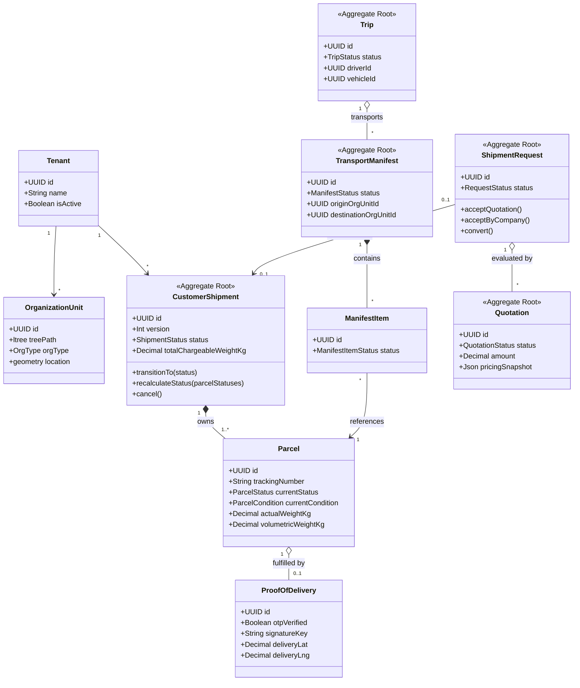

# Domain Model & Aggregate Boundaries

This document describes the core domain model, entity relationships, aggregate boundaries, and consistency invariants based on the actual database schema and domain entity implementations in the repository.

---

## 1. Aggregate Overview

The platform partitions its logistics operations into distinct aggregates to maintain consistency boundaries without massive transactional locks:



---

## 2. Core Entities & Aggregates

### 2.1 CustomerShipment (Aggregate Root) & Parcel
- **Source of Truth**: `src/modules/customer-shipment/shipment/domain/entities/customer-shipment.entity.ts` and Prisma `model customer_shipment`, `model parcel`.
- **Aggregate Boundary**: `CustomerShipment` is the aggregate root. It owns one or more `Parcel` entities. Changes to parcel collection, cancellation, or overall weight boundaries flow through the shipment aggregate.
- **Key Invariants**:
  - **Optimistic Concurrency Control (OCC)**: Guarded by a numeric `version` column. Mutations update the database using `where: { id, version }` and increment `version` by 1. If zero rows match, a `ConflictException` is thrown.
  - **Origin and Destination**: `originOrgUnitId` and `destinationOrgUnitId` must not be identical.
  - **Chargeable Weight Computation**:
    $$\text{Total Chargeable Weight} = \sum_{p \in \text{Parcels}} \max\left(p.\text{actualWeightKg},\, p.\text{volumetricWeightKg}\right)$$
  - **Derived Lifecycle Invariant**: An out-of-order parcel scan cannot move a shipment backwards in its lifecycle (`ALLOWED_TRANSITIONS[this._status].includes(target)`).

### 2.2 Proof of Delivery (POD)
- **Source of Truth**: Prisma `model proof_of_delivery`.
- **Relationship**: 1-to-1 with `parcel` (`@@unique([parcel_id])`).
- **Invariants**:
  - Requires delivery employee assignment (`delivered_by_employee_id`).
  - Stores verification metadata: recipient name, optional national ID, OTP verification status (`otp_verified`), stored signature key (`signature_key`), parcel photos, and geospatial point coordinates (`delivery_lat`, `delivery_lng`).

### 2.3 ShipmentRequest & Quotation
- **Source of Truth**: `src/modules/shipment-request/request/domain/entities/shipment-request.entity.ts`, `src/modules/shipment-request/quotation/domain/entities/quotation.entity.ts`.
- **Aggregate Boundary**: `ShipmentRequest` represents pre-fulfillment customer demand. `Quotation` represents pricing assessments for that demand. They are kept as separate aggregates to allow multiple pricing iterations without mutating customer demand details.
- **Key Invariants**:
  - Acceptance of a quotation can only occur when `ShipmentRequest` is in `PENDING` state.
  - Conversion into an active `CustomerShipment` is only permitted after `COMPANY_ACCEPTED` status.
  - Quotation prices must balance: `amount === basePrice + weightCharge + extraFees`.

### 2.4 OrganizationUnit & Network Topology
- **Source of Truth**: Prisma `model organization_unit`.
- **Classification**: `REGION`, `HUB`, `WAREHOUSE`, `BRANCH`, `LOCKER`.
- **Hierarchical Modeling**: Uses the PostgreSQL `ltree` extension via column `tree_path` (e.g. `Root.RegionA.Hub01.Branch12`).
- **Geospatial Coordinates**: Uses PostgreSQL PostGIS `location` column (`Unsupported("geometry")`) indexed via GiST (`idx_org_unit_location`).

### 2.5 Fleet: Vehicle, VehicleAssignment & Trip
- **Source of Truth**: Prisma `model vehicle`, `model vehicle_assignment`, `model trip`.
- **Invariants**:
  - **Single Active Driver/Vehicle Assignment**: Enforced at the database level via partial unique indexes:
    ```prisma
    @@unique([employee_id], map: "unique_active_employee_assignment", where: { is_active: true })
    @@unique([vehicle_id], map: "unique_active_vehicle_assignment", where: { is_active: true })
    ```
    This guarantees that neither a driver nor a vehicle can be concurrently assigned to multiple active routes.

### 2.6 TransportManifest & ManifestItem
- **Source of Truth**: Prisma `model transport_manifest`, `model manifest_item`.
- **Boundary**: Groups parcels assigned to an inter-facility leg between `origin_org_unit_id` and `destination_org_unit_id`.
- **Statuses**: `OPEN` $\rightarrow$ `READY_FOR_DISPATCH` $\rightarrow$ `ASSIGNED` $\rightarrow$ `LOADING` $\rightarrow$ `IN_TRANSIT` $\rightarrow$ `COMPLETED`.
- **Items**: Tracks each individual parcel loading state: `PENDING_LOAD`, `LOADED`, `UNLOADED`, `MISSING`.

### 2.7 ParcelMovement (Audit Log / Custody Chain)
- **Source of Truth**: Prisma `model parcel_movement`.
- **Boundary**: Append-only event store capturing every custody handover and scan:
  - Identifies acting employee (`performed_by_employee_id`), facility (`organization_unit_id`), and optional `trip_id`.
  - Records transition deltas: `previous_status`, `new_status`, `previous_condition`, `new_condition`.
  - Captures geographical coordinates at the time of the event.

### 2.8 Billing: Invoice, InvoiceCounter & Payment
- **Source of Truth**: Prisma `model invoice`, `model invoice_counter`, `model payment`.
- **Sequential Numbering Invariant**: `invoice_counter` composite primary key `[tenant_id, year]` ensures non-conflicting, gap-free invoice sequence generation within each tenant's calendar year.
- **Payment Reconciliation**: Records amount, method (`CASH`, `ONLINE`, `COD`, `BANK_TRANSFER`), and updates invoice balance (`UNPAID` $\rightarrow$ `PARTIALLY_PAID` $\rightarrow$ `PAID`).
