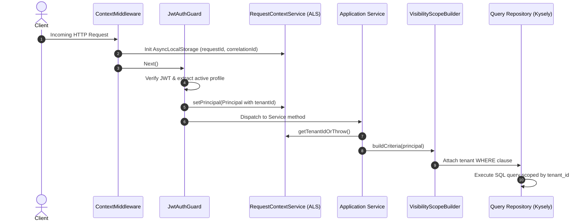

# Multi-Tenancy & Tenant Context Architecture

This document describes how tenant scoping and data boundaries are designed and enforced across the platform.

---

## 1. Multi-Tenancy Model: Shared Process, Discriminator Column

The platform employs a **shared-database, shared-schema** multi-tenant model. All tenant data resides in the same PostgreSQL database, partitioned by a foreign key column:
- `tenant_id`: UUID column present on tenant-owned tables (e.g. `customer_shipment`, `parcel`, `employee`, `organization_unit`, `vehicle`, `invoice`).
- Platform-level entities (such as `users` and `global_location`) are global and not bound to a single tenant.

Tenant-scoped access is enforced through request context propagation and authorization visibility scopes rather than separate database schemas or database-level connection switching.

---

## 2. Request Context Propagation via `AsyncLocalStorage`

To avoid passing `tenantId` through every controller, service, and repository method parameter, the system uses Node.js **`AsyncLocalStorage`** encapsulated in `src/packages/context/`.



### Key Components:
1. **`ContextMiddleware`**: Bound globally (`forRoutes('*')`) in `ContextModule`. Generates a unique `requestId` and initializes the `AsyncLocalStorage` store before routing.
2. **`Principal`**: Once authenticated, the user's security identity is saved in the store via `RequestContextService.setPrincipal()`. The `Principal` holds `userId`, `tenantId`, `roles`, and `permissions`.
3. **`RequestContextService`**: Provides accessors to extract context:
   ```typescript
   public getTenantIdOrThrow(): string {
     const tenantId = this.getTenantId();
     if (!tenantId) {
       throw new Error('Tenant ID is missing from the current request context.');
     }
     return tenantId;
   }
   ```

---

## 3. Data-Access Boundary Enforcement

The architecture guards against cross-tenant data access at two levels:

### 3.1 Write Operations (Prisma Command Repositories)
During writes, services resolve the active tenant ID from `RequestContextService` or verified payloads, explicitly binding new rows to the current `tenant_id`:
```typescript
const tenantId = this.requestContext.getTenantIdOrThrow();
await this.commandRepository.create({ tenantId, ...dto });
```

### 3.2 Read Operations (Visibility Scopes)
For query-side reads, the authorization package introduces **Visibility Scope Builders** (e.g., `TenantVisibilityScope`, `ShipmentRequestVisibilityScope`).
These builders inspect the authenticated `Principal` and append mandatory tenant constraints to database queries:
```typescript
// Query filtering attaches tenant boundary before query execution
where('tenant_id', '=', principal.tenantId)
```

---

## 4. Cross-Tenant User Identity (Profile Switching)

A single human user (`users` table) can interact with multiple tenants:
- A user may own **Tenant A**, act as a driver/employee in **Tenant B**, and hold a personal shipping account as a **Customer**.
- During login, the authentication service validates active profiles across tenants.
- When an access token is issued (or switched via `select-profile`), the token encodes the active profile's `tenantId`.
- The request context receives only the `tenantId` corresponding to the currently active profile.

---

## 5. Potential Failure Modes & Architectural Caveats

The system is designed to prevent cross-tenant data access, but engineers working on the codebase should remain aware of potential failure modes:

1. **Background Tasks & Cron Jobs**:
   Scheduled cron jobs (such as `LocationFlusherService` or `InvoiceDueReminderJob`) execute outside of an incoming HTTP request cycle. They do **not** have an active `AsyncLocalStorage` request context. These background jobs must explicitly iterate over tenants or read `tenant_id` directly from database records rather than calling `RequestContextService.getTenantIdOrThrow()`.

2. **Asynchronous Event Handlers**:
   When events are published via `EventEmitter2`, the execution context may not inherit the caller's `AsyncLocalStorage` if handled asynchronously without context propagation. Handlers must receive `tenantId` explicitly inside the event payload.

3. **Unscoped Direct Kysely Queries**:
   Because Kysely builds raw SQL queries directly, developers must consistently invoke visibility scopes or include `where('tenant_id', '=', tenantId)` clauses. Omitting this filter in custom queries would result in an unscoped cross-tenant query.
