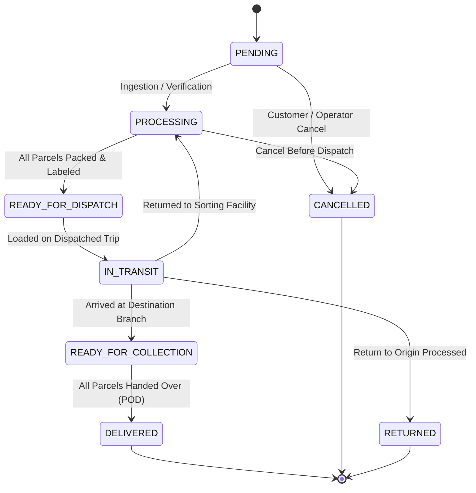
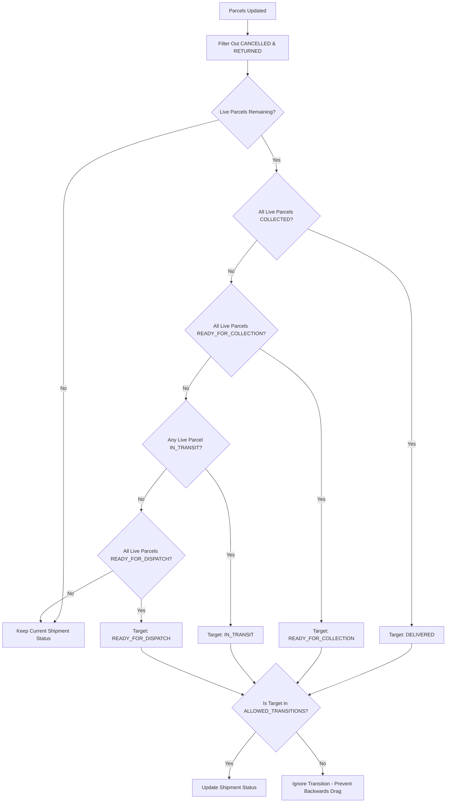

# Shipment Lifecycle & State Transitions

This document details the shipment lifecycle, parcel state synchronization, concurrency guards, and cancellation rules based directly on `CustomerShipment` domain entity implementation (`src/modules/customer-shipment/shipment/domain/entities/customer-shipment.entity.ts`).

---

## 1. Shipment State Machine

The shipment entity enforces explicit allowable state transitions. Any transition not defined in `ALLOWED_TRANSITIONS` results in a `ConflictException`.



### Transition Rules Table

| Current Status | Permitted Next Statuses | Invariants / Triggers |
|---|---|---|
| `PENDING` | `PROCESSING`, `CANCELLED` | Shipment record created; awaits warehouse intake. |
| `PROCESSING` | `READY_FOR_DISPATCH`, `CANCELLED` | Items measured, weighed, labeled; packaging confirmed. |
| `READY_FOR_DISPATCH` | `IN_TRANSIT` | Assigned to a transport manifest and trip departs. |
| `IN_TRANSIT` | `PROCESSING`, `READY_FOR_COLLECTION`, `RETURNED` | Arrives at intermediate sorting hub (`PROCESSING`), reaches destination branch (`READY_FOR_COLLECTION`), or delivery failed and returned (`RETURNED`). |
| `READY_FOR_COLLECTION` | `DELIVERED` | Recipient claims parcel at branch or courier completes delivery. Requires valid Proof of Delivery. |
| `DELIVERED` | *(None - Terminal)* | Final state. No further transitions permitted. |
| `CANCELLED` | *(None - Terminal)* | May only be cancelled from `PENDING` or `PROCESSING`. Cannot be cancelled once dispatched. |
| `RETURNED` | *(None - Terminal)* | Shipment returned to origin facility. Terminal state. |

---

## 2. Parcel State Mapping & Automatic Synchronization

A single `CustomerShipment` contains one or more `Parcel` entities. Rather than manually updating the shipment state independently, the domain entity provides `recalculateStatus(parcelStatuses: ParcelStatus[])`.

### Deployed Parcel Statuses
- `PROCESSING`
- `READY_FOR_DISPATCH`
- `IN_TRANSIT`
- `ARRIVED_AT_UNIT`
- `READY_FOR_COLLECTION`
- `COLLECTED`
- `RETURNED`
- `CANCELLED`

### Status Derivation Logic (`recalculateStatus`)



#### Monotonic Progression Invariant
If a parcel scan is processed out of sequence (e.g. network latency causes an earlier facility scan to arrive after a later branch arrival scan), `recalculateStatus` checks:
```typescript
if (!ALLOWED_TRANSITIONS[this._status].includes(target)) {
  return null;
}
```
This guarantees that an out-of-order parcel scan will never drag a shipment backwards in its lifecycle.

---

## 3. Concurrency Protection (Optimistic Locking)

High-concurrency logistics hubs handle simultaneous parcel barcode scans across different warehouse doors. To prevent lost updates, `CustomerShipment` implements Optimistic Concurrency Control:

1. **Entity Versioning**: The entity holds an integer `version` field (initialized to 1).
2. **Atomic Conditional Update**: When saving status changes in `ShipmentCommandRepository`:
   ```typescript
   const result = await this.prisma.client.customer_shipment.updateMany({
     where: { id: shipmentId, version: currentVersion },
     data: { status: newStatus, version: { increment: 1 } },
   });

   if (result.count === 0) {
     throw new ConflictException(
       'Shipment was modified by another process. Please retry.',
     );
   }
   ```
3. If two workers attempt to modify the shipment concurrently, the first write increments `version`. The second write matches zero rows (`version` mismatch) and is rejected with `ConflictException`, instructing the client or service to reload fresh state and retry.

---

## 4. Cancellation Rules

- A shipment can only be cancelled while in `PENDING` or `PROCESSING` state (`isCancellable()` returns `true`).
- Once a shipment enters `READY_FOR_DISPATCH` or `IN_TRANSIT`, cancellation through the regular client flow is prohibited.
- A shipment whose parcels are all cancelled remains in its current state until explicitly cancelled by an authorized user.
