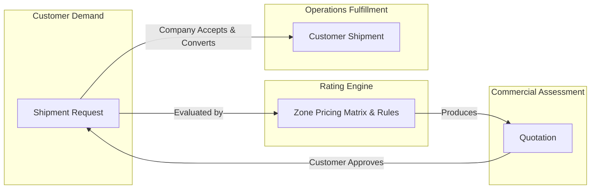
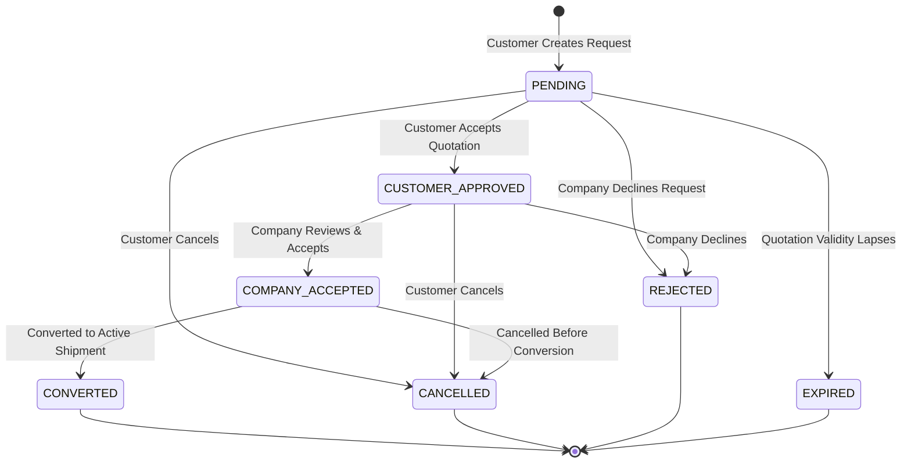
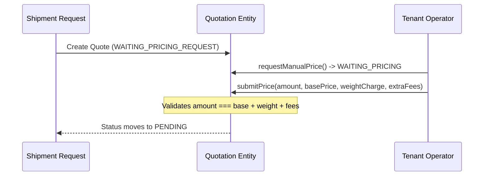

# Shipment Request, Pricing & Quotation Engine

This document outlines the demand capture, dynamic rating, quotation generation, and shipment conversion workflows implemented under `src/modules/shipment-request/`.

---

## 1. Separation of Responsibilities

The system deliberately separates four interrelated concepts to avoid domain pollution:



| Concept | Responsibility | Storage Table |
|---|---|---|
| **Shipment Request** | Captures uncommitted customer shipping demand (sender, receiver, packages, locations). | `shipment_request` |
| **Zone Pricing Matrix** | Configurable tenant pricing rules across geographical zones and service levels. | `zone_pricing_matrix`, `handling_fee_rule` |
| **Quotation** | Time-limited commercial quote for a specific request, freezing price components. | `quotation` |
| **Customer Shipment** | Operational aggregate created when an accepted request is converted for execution. | `customer_shipment` |

---

## 2. Shipment Request Lifecycle

The `ShipmentRequest` aggregate root (`src/modules/shipment-request/request/domain/entities/shipment-request.entity.ts`) enforces the pre-fulfillment state machine:



### Invariants:
1. **Quotation Acceptance (`acceptQuotation`)**: Requires request state `PENDING`. Updates state to `CUSTOMER_APPROVED` and stores `approvedQuotationId`.
2. **Company Acceptance (`acceptByCompany`)**: Requires `CUSTOMER_APPROVED`. Moves state to `COMPANY_ACCEPTED`.
3. **Conversion (`convert`)**: Only permissible when request is `COMPANY_ACCEPTED`. Moves state to `CONVERTED` and triggers operational shipment creation.
4. **Cancellation / Rejection Boundary**: Requests in `CONVERTED`, `CANCELLED`, `REJECTED`, or `EXPIRED` status cannot be cancelled or rejected.

---

## 3. Dynamic Rating & Pricing Calculation

The rating engine resolves pricing using tenant zone relationships, dimensional weights, and handling fee surcharges:

### 3.1 Chargeable Weight Calculation
Freight pricing is calculated against chargeable weight, which is the greater of actual physical weight and volumetric (dimensional) weight:

$$\text{Volumetric Weight (kg)} = \frac{\text{Length (cm)} \times \text{Width (cm)} \times \text{Height (cm)}}{\text{Volumetric Divisor}}$$

$$\text{Chargeable Weight} = \max\left(\text{Actual Weight},\, \text{Volumetric Weight}\right)$$

> The `Volumetric Divisor` is configured per tenant in `tenant_pricing_settings` (default: `5000`).

### 3.2 Zone Pricing Matrix Resolution
The tenant defines routes in `zone_pricing_matrix` indexed by:
`[tenant_id, origin_zone_id, destination_zone_id, service_level]`

- **Base Price**: Covers weight up to `base_weight_kg`.
- **Excess Weight Charge**:
  $$\text{Weight Charge} = \max\left(0,\, \text{Chargeable Weight} - \text{base\_weight\_kg}\right) \times \text{price\_per\_extra\_kg}$$

### 3.3 Specialized Handling Surcharges
Additional fees are resolved from `handling_fee_rule` for parcels flagged as:
- `FRAGILE`
- `PERISHABLE`
- `HAZARDOUS`
- `TEMPERATURE_SENSITIVE`

### 3.4 Service Levels
Pricing models vary by delivery SLA:
- `STANDARD`: Regular ground transit.
- `EXPRESS`: Expedited delivery.
- `SAME_DAY`: Immediate intraday courier transit.
- `REFRIGERATED`: Temperature-controlled cargo transit.

---

## 4. Quotation Aggregate & Price Freezing

The `Quotation` aggregate (`src/modules/shipment-request/quotation/domain/entities/quotation.entity.ts`) manages commercial proposals:

### 4.1 Quotation Types
- **`AUTOMATIC`**: Generated instantly via domain event listeners (`QuotationListener`) when an exact route match exists in `zone_pricing_matrix`.
- **`MANUAL`**: Flagged as `WAITING_PRICING_REQUEST` or `WAITING_PRICING` when custom cargo parameters require operator intervention.

### 4.2 Manual Quotation Workflow


### 4.3 Immutable Pricing Snapshot
When a quotation is issued, an immutable snapshot of all rating rules and calculated components is stored in the `pricing_snapshot` JSON column:
```json
{
  "basePrice": 25.00,
  "weightCharge": 12.50,
  "handlingFees": 5.00,
  "currency": "SY",
  "calculatedAt": "2026-09-16T12:00:00Z"
}
```
This guarantees that if the tenant subsequently updates their `zone_pricing_matrix` or handling fee tariffs, active or approved quotations remain unaffected.

### 4.4 Expiration
Quotations have a `valid_until` timestamp calculated using the tenant's `quotation_validity_hours` setting (default: 48 hours). Expired quotes cannot be approved by customers.
