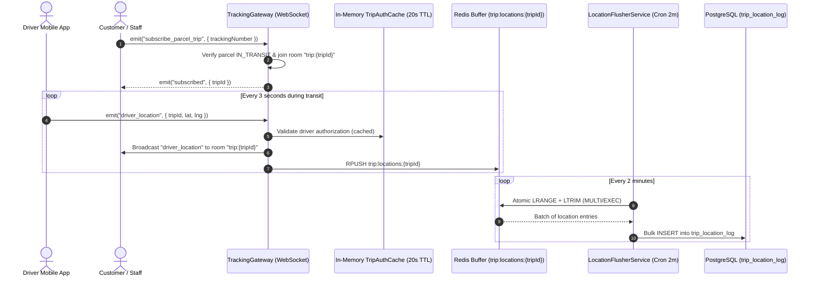

# Telematics, Live Tracking & Custody Chain Architecture

This document details the tracking, telematics ingestion, WebSocket real-time delivery, and write-behind persistence implementations located in `src/modules/tracking/` and `src/modules/tracking-gateway.module.ts`.

---

## 1. Tracking Identifiers & Custody Chain

### 1.1 Unique Tracking Number Generation
Parcels carry a globally unique `tracking_number` generated prior to database insertion:
```typescript
const candidate = `${trackingPrefix}${randomSuffix}`;
```
If a collision occurs, generation retries up to a configured threshold before raising a friendly exception rather than failing with an unhandled database unique constraint violation.

### 1.2 Immutable Custody Chain (`parcel_movement`)
Every custody handover is recorded in the append-only `parcel_movement` table:
- **Actor Identity**: `performed_by_employee_id` and employee name.
- **Facility & Context**: `organization_unit_id`, `organization_unit_name`, and optional `trip_id`.
- **State Deltas**: `previous_status`, `new_status`, `previous_condition`, `new_condition`.
- **Spatial Position**: `organization_latitude`, `organization_longitude`.
- **Action Categories**: `RECEIVED_AT_BRANCH`, `LOADED_ON_TRIP`, `TRIP_DEPARTED`, `ARRIVED_AT_FACILITY`, `READY_FOR_COLLECTION`, `COLLECTED`, `RETURN_COMPLETED`, `CANCELLED`, `CONDITION_UPDATED`, `POD_COMPLETED`.

---

## 2. Real-Time Telematics Ingestion & WebSocket Gateway

Driver GPS coordinates and live parcel events are managed by `TrackingGateway` (`src/modules/tracking/presentation/gateways/tracking.gateway.ts`):



### 2.1 WebSocket Events Specification

| Event Name | Direction | Payload | Description |
|---|---|---|---|
| `subscribe_parcel_trip` | Client $\rightarrow$ Server | `{ trackingNumber: string }` | Client joins the WebSocket room for the active trip carrying the given parcel. |
| `subscribed` | Server $\rightarrow$ Client | `{ tripId: string, tripNumber?: string }` | Confirmation that subscription was granted. |
| `driver_location` | Client $\rightarrow$ Server | `{ tripId: string, lat: number, lng: number }` | Driver device transmits live GPS coordinates. |
| `driver_location` | Server $\rightarrow$ Client | `{ tripId: string, lat: number, lng: number, recordedAt: string }` | Broadcast to all clients subscribed to the trip room. |
| `parcel_movement` | Server $\rightarrow$ Client | `{ parcelId, trackingNumber, actionType, status, ... }` | Broadcast when a parcel movement event is appended to a trip. |

### 2.2 Short-Lived Driver Auth Caching
Drivers transmit GPS fixes approximately every 3 seconds. To avoid executing database queries on every ping, `TrackingGateway` maintains an in-memory authorization cache with a 20-second TTL (`tripAuthCache`). Once validated, subsequent pings within the TTL window are processed immediately.

---

## 3. Write-Behind Ingestion Pattern (`LocationFlusherService`)

Writing high-frequency GPS fixes directly to PostgreSQL on every incoming WebSocket ping would cause excessive disk I/O and lock contention under multi-driver loads. The system implements a **Write-Behind Caching Pattern**:

1. **Ingestion Buffer**:
   Incoming coordinates are serialized as JSON and pushed to a Redis list:
   ```text
   Key: trip:locations:{tripId}
   Data: [ "{ lat, lng, recordedAt, driverId }", ... ]
   ```

2. **Scheduled Atomic Flush (`@Cron('*/2 * * * *')`)**:
   `LocationFlusherService` executes every 2 minutes. To prevent race conditions during concurrent driver writes, the list is drained atomically using a Redis transaction (`MULTI` / `EXEC`):
   ```typescript
   const results = await this.redis
     .multi()
     .lrange(key, 0, -1)
     .ltrim(key, 1, 0)
     .exec();
   ```
   - `lrange(key, 0, -1)` fetches all accumulated coordinates.
   - `ltrim(key, 1, 0)` atomically clears the list.

3. **Batch Insertion**:
   Drained entries are deserialized and persisted via a single bulk `createMany` insert query into PostgreSQL (`trip_location_log`), preserving historical routes with minimal database connection time.

---

## 4. Decoupling from Circular Dependencies

`CustomerShipmentModule` needs tracking data, while `TrackingGateway` requires shipment status verification. 

To eliminate circular dependencies (`CustomerShipmentModule` $\leftrightarrow$ `TrackingModule`), the gateway and flusher service are isolated inside **`TrackingGatewayModule`** (`src/modules/tracking-gateway.module.ts`):
- `TrackingGatewayModule` imports `CustomerShipmentModule` and `FleetModule`.
- `TrackingCommandService` communicates with `TrackingGateway` exclusively using decoupled events (`EventEmitter2`), keeping module dependency direction strictly acyclic.
