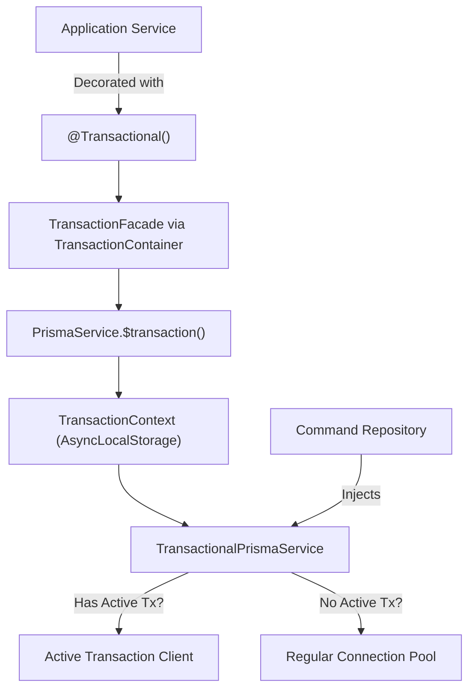
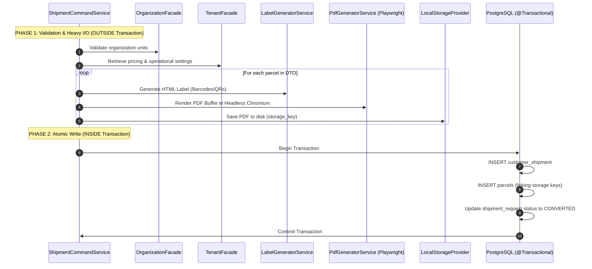

# Transaction Management Architecture

This document describes how database transactions are managed across application services and repositories without leaking ORM infrastructure dependencies into domain logic.

---

## 1. Architectural Goal: Infrastructure Isolation

In Clean Architecture and Domain-Driven Design, application services coordinate business workflows and should not directly depend on ORM-specific transaction objects (such as `PrismaClient.$transaction` or raw SQL handles). 

The platform addresses this via `src/packages/transaction/`, which uses the **Container Pattern** and **`AsyncLocalStorage`** to decouple transaction boundaries from repository implementations.



---

## 2. Key Components (`packages/transaction`)

### 2.1 `@Transactional()` Method Decorator
Marks an application service method as an atomic transaction boundary.
- If an active transaction already exists in the current call stack, the decorator reuses the existing client (nested transaction reuse).
- If no transaction exists, it requests a new interactive transaction from `TransactionFacade`.
- Commits automatically if the method completes; rolls back automatically if an unhandled exception is thrown.

```typescript
@Injectable()
export class ShipmentCommandService {
  @Transactional()
  private async persistShipment(
    tenantId: string,
    dto: CreateShipmentDto,
    prepared: PreparedParcel[],
    totalChargeableWeightKg: number,
  ): Promise<{ id: string }> {
    // Both repository calls execute within the SAME database transaction
    const shipment = await this.commandRepository.create(...);
    for (const parcel of prepared) {
      await this.parcelCommandRepository.create(...);
    }
    return shipment;
  }
}
```

### 2.2 `TransactionContext` (`AsyncLocalStorage`)
Tracks the active Prisma transaction client (`tx`) for the duration of the asynchronous execution chain. Repositories do not need `tx` passed down through their method signatures.

### 2.3 `TransactionalPrismaService`
A custom proxy wrapper injected into command repositories:
```typescript
@Injectable()
export class TransactionalPrismaService {
  constructor(private readonly prisma: PrismaService) {}

  get client(): PrismaClient {
    const tx = TransactionContext.getClient();
    return (tx as PrismaClient) ?? this.prisma;
  }
}
```
If called within a `@Transactional()` scope, `client` returns the active transactional Prisma client. Otherwise, it transparently falls back to the standard `PrismaService` pool.

### 2.4 `TransactionContainer`
A service locator pattern initialized during application startup in `main.ts` (`TransactionContainer.setApp(app)`). This allows the `@Transactional()` decorator to resolve `TransactionFacade` without requiring services to inject `PrismaService` into their constructors.

---

## 3. Design Rule: Short-Lived Transactions & Outside Preparation

A core architectural rule enforced in the codebase is **keeping transactions as short as possible** to minimize database connection hold time and reduce lock contention.

### Example: Shipment Creation Workflow (`ShipmentCommandService.createShipment`)



**Why this matters**:
- Headless browser rendering via Playwright and disk/cloud file uploads involve variable I/O latency.
- If these operations were executed inside an open database transaction, database connection pool exhaustion would occur under moderate concurrency.
- By preparing labels and files upfront, the database transaction opens only for the microsecond-level write phase.
